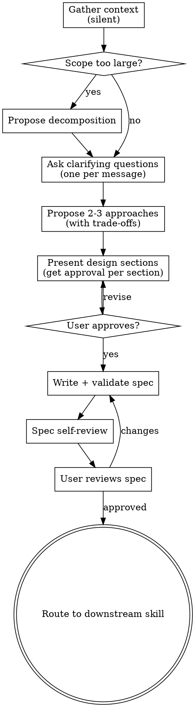

# lets-brainstorm

Turn an unresolved question into a validated spec, then route to the right downstream skill.

Do NOT implement, scaffold, write code, or invoke any implementation skill until you have
presented a design and the user has approved it. This applies to EVERY project regardless of
perceived simplicity.

## Anti-pattern: "This Is Too Simple To Need A Design"

Every project goes through this process. A task tracker, a single-function utility, a config
change — all of them. "Simple" projects are where unexamined assumptions cause the most wasted
work. The design can be short (a few sentences for truly simple projects), but you MUST present
it and get approval.

## Process Flow



## Modes

| Mode | When | Behavior |
|---|---|---|
| **Full** (default) | Multi-component scope, cross-team impact, production risk | One question per message, 2-3 approaches, full spec sections |
| **Light** | Single-file, low-risk, or user says "quick"/"express" | Up to 3 batched questions, 1 recommendation + 1 alternative, minimal spec |

Determine mode internally during context gathering. Do not present the mode choice to the user.
If Light Mode discovers multi-component scope or compliance risk mid-exploration, escalate to
Full Mode immediately.

## Anti-patterns

- **Front-loading process before questions** — the user's first interaction should be a clarifying question, not a status report about governance checks or classification taxonomy.
- **Asking multiple questions at once in Full Mode** — one question per message. Prefer multiple-choice when options are enumerable.
- **Implementing without an approved design** — even for "simple" changes.
- **Staying in Light Mode when scope grows** — if you discover cross-boundary impact, escalate.
- **Using superpowers:brainstorming inside letsbe10x** — this skill supersedes it.
- **Routing before spec validation and user approval** — the spec gates are non-negotiable.

## When to Use

- Any creative work is beginning — features, components, added functionality, behavior modifications.
- The right approach, architecture, or solution is not yet agreed.
- A decision must be made before implementation can begin.
- A request is ambiguous enough that starting to build would risk rework.
- The user asks for a "quick brainstorm" on a small idea (use Light Mode).

## When Not to Use

- A spec and approach are already approved — invoke `lets-create-plan` directly.
- The change is a mechanical single-file edit with zero design decisions.
- Product opportunity discovery — use `lets-opportunity-discovery`.
- Debugging / triage — use `lets-triage-issue` or `lets-triage-incident`.

---

## Step 1 — Gather context (silent)

Before your first message to the user, silently:

1. Check for an active governance context:
   ```bash
   lets run list --format json | jq '.[0].run_dir // empty'
   ```
   If found: read `workflow_context.json` and `classification.json`. If governance blocks, stop and explain. Otherwise note the context.

2. Read: recent commits, existing specs/ADRs, codebase structure relevant to the request.

3. Assess scope: if the request describes multiple independent subsystems, flag this for decomposition in your first message.

4. Determine mode (Full/Light) based on scope and risk. Do not surface this to the user.

**Your first visible message to the user is a clarifying question (or decomposition proposal if scope is too large).**

---

## Step 2 — Clarify and explore

### Full Mode

Ask one question per message. Prefer multiple-choice when options are enumerable.

Focus on understanding:
1. **Problem** — what specific problem does this solve, and for whom?
2. **Constraints** — performance, compatibility, security, team bandwidth.
3. **Success criteria** — what does done look like?
4. **Scope boundary** — what is explicitly out of scope?

Stop asking when you have enough to propose distinct approaches.

**Propose 2–3 approaches** with explicit trade-offs. Lead with your recommendation and explain why. Get the user to confirm a direction.

### Light Mode

Ask up to 3 focused questions in a single message:
1. Problem + who it serves
2. Success signal
3. Known constraints (skip if none)

Propose 1 recommendation + 1 alternative with one-line trade-offs. Get confirmation.

**Escalation:** if answers reveal multi-component scope, migration, or compliance surface → tell the user and switch to Full Mode.

---

## Step 3 — Present design

### Full Mode

With the approach confirmed, present design section by section. Ask "does this look right?" after each section before continuing.

| Section | What to cover |
|---|---|
| Architecture | Components, responsibilities, boundaries |
| Data model | Entities, relationships, storage — omit if stateless |
| Component design | Interfaces, dependencies, isolation |
| Data flow | Request → processing → response, including errors |
| Error handling | How failures surface and recover |
| Testing approach | Unit, integration, acceptance scenarios by name |

Scale each section to its complexity — a few sentences if straightforward, more detail if nuanced.

Design for isolation: each component has one purpose, communicates through defined interfaces, and can be understood without reading its internals.

In existing codebases: follow established patterns. Include improvements only when they directly serve this goal.

### Light Mode

Present a single condensed block:
- **Approach** — what we'll build and why (one paragraph)
- **Touch points** — files/modules that change (if list grows, escalate)
- **Testing** — named scenarios

Get confirmation.

---

## Step 4 — Write and validate spec

### Full Mode

Use `assets/spec-template.md` as the starting structure. Fill every applicable section. Remove sections that don't apply. Every section must be concrete — no placeholders.

### Light Mode

Use `assets/light-spec-template.md`. Required sections: Problem, Approach, Success Criteria, Testing Approach.

### Both modes

Save the spec, then validate:
```bash
python3 skills/lets-brainstorm/scripts/validate_spec.py "$SPEC_PATH"
python3 skills/lets-brainstorm/scripts/validate_spec.py --light "$SPEC_PATH"
```

Fix every issue and re-run until the validator exits 0. Commit:
```bash
git add "$SPEC_PATH" && git commit -m "spec: $(basename "$SPEC_PATH" .md)"
```

### Spec self-review

After writing, check:
1. **Placeholder scan** — any incomplete sections or vague requirements? Fix them.
2. **Internal consistency** — do sections contradict each other?
3. **Scope check** — focused enough for a single implementation plan?
4. **Ambiguity check** — could any requirement be interpreted two ways? Pick one.

Fix issues inline. No separate review pass needed.

---

## Step 5 — User review gate

> "Spec written and committed. Please review — let me know if you want any changes before I route to the next step."

Wait for explicit approval. If changes requested: update, re-validate, ask again.

---

## Step 6 — Route to downstream skill

Consult `references/routing-guide.md` to confirm the correct downstream skill:

| Exploration type | Default downstream |
|---|---|
| Feature with clear scope | `lets-create-plan` |
| Architecture decision | `lets-create-plan` |
| Product/outcome unclear | `lets-opportunity-discovery` |
| Small, immediately implementable | `lets-spec-to-pr` |

Present the routing decision to the user, then invoke the target skill.

---

## Outputs

- Committed spec — validated and user-approved
- Routing decision (exploration type → downstream skill)
- Done when: validator exits 0, user has approved, and downstream skill invoked
