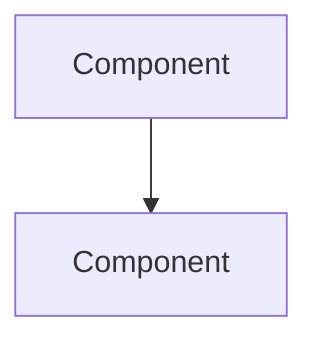

# <Feature Name> — Design Spec

**Date:** YYYY-MM-DD
**Status:** Draft | Approved
**Author:** <!-- agent or human -->

---

## Problem

<!-- One paragraph: what problem does this solve, and for whom? -->

## Goals

- <!-- Primary goal -->
- <!-- Secondary goal (if any) -->

## Non-Goals

- <!-- Explicitly out of scope -->

## Success Criteria

- <!-- How do we know this is done? Measurable where possible. -->

---

## Architecture

<!-- High-level structure: key components, their responsibilities, and how they fit together.
     2–5 sentences or a short list. -->

## Data Model

<!-- Entities, relationships, storage decisions.
     Omit if the feature has no persistent state. -->

| Entity | Fields | Notes |
|--------|--------|-------|
|        |        |       |

## Component Design

<!-- For each significant component: what it does, its interface, what it depends on.
     Each component should have one clear responsibility. -->

### `<ComponentName>`

- **Responsibility:**
- **Interface:**
- **Dependencies:**

## Data Flow

<!-- Request → processing → response, including the main error path.
     A short numbered list or a prose walkthrough. -->

1.
2.
3.

## UX Design (include when the feature has a user-facing surface)

<!-- Remove this section entirely if the feature has no UI.
     Include it whenever users will see, click, or interact with something. -->

### UX Flow
<!-- Screen-to-screen navigation, entry/exit points. Mermaid or text. -->

### Interaction Model
<!-- What the user does → what the system responds. Key interactions only. -->

### Key Screens
<!-- What information is shown, what actions are available. One paragraph per screen. -->

### Error & Empty States
<!-- What the user sees when things go wrong or data is missing. -->

## Architecture Diagram (include when complexity warrants it)

<!-- Remove this section for trivial changes.
     Include for cross-module, new abstractions, or significant data flow changes.
     Use Mermaid, dot, or ASCII. Update it as the design evolves. -->

## Error Handling

<!-- How failures surface to callers or users, and how they recover. -->

---

## Testing Approach

<!-- Unit, integration, and acceptance tests. Name specific scenarios, not just categories. -->

- **Unit:**
- **Integration:**
- **Acceptance:**

---

## Open Questions

<!-- Anything not yet decided. Each item must be resolved before lets-create-plan is invoked. -->

- [ ] <!-- Question -->
