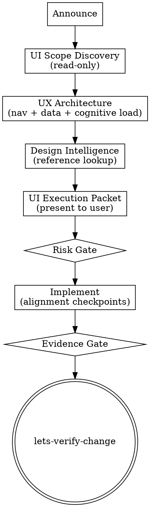

## Overview

`lets-build-ui` is a UI design + development workflow that turns “build/redesign the UI” requests into (1) a functional inventory + core journey audit, (2) a **UX architecture pass** (navigation + data flows + cognitive load), (3) a concrete direction + tokens, and (4) a staged implementation plan with evidence-gated ship checks.

When a **live URL or dev server** is available, invoke **`lets-browser-evidence`** for rerunnable screenshots and journey scripts (Webwright engine installs with `make lets-build-ui`). See [`references/webwright-integration.md`](references/webwright-integration.md).

It is intentionally pragmatic: the goal is **product-purpose alignment + design-system-lite + quality gates + implementation sequencing**, not a speculative rebrand unless the brief says so.

## Process Flow



## When to Use

- The UI is functional but feels inconsistent, dated, or “not polished”.
- You need a coherent direction and a token scheme before scaling UI work.
- You are adding dark mode, responsive behavior, or improving accessibility.
- You need a pragmatic UX audit that produces prioritized fixes with repro notes.

## Steps

1. Announce (mandatory, before any UI edits):
   - State: “Using `lets-build-ui`.”
   - Hard limit: `do_not_implement_before_ui_execution_packet_presented`.
2. UI scope discovery (read-only):
   - Fill the brief: [`references/ui_ux_brief.yml`](references/ui_ux_brief.yml).
   - **If the target uses letsbe10x ux packages or the ux-engine repo** (gt-ui, control-plane/ui,
     lens-ui, showcase): read [`references/ux-engine-stack.md`](references/ux-engine-stack.md),
     ground plans against the ux-engine repo baseline cited in that reference,
     and fill [`references/ux-engine-inventory.yml`](references/ux-engine-inventory.yml).
     For Stage 9 / interaction-model work, also apply
     [`references/agentic-ux-interaction-checklist.md`](references/agentic-ux-interaction-checklist.md)
     and `decision-031` — do not treat polish work as a substitute for declared actions or identity.
   - Capture “no regression” contracts:
     - Functional inventory: [`references/functional_inventory.yml`](references/functional_inventory.yml).
     - Core journeys / acceptance contract: [`references/core_journeys.yml`](references/core_journeys.yml).
   - Capture UI evidence (screenshots/URL/dev server). Enforce `Checkpoint evidence_gate`.
   - **Browser evidence (when URL/localhost is available):** announce and run **`lets-browser-evidence`** with program `ui_build`; use the UI audit and journey sections in that skill (install with `make lets-browser-evidence`). Mirror paths into `evidence.browser_automation` in [`references/ui_ux_brief.yml`](references/ui_ux_brief.yml).
   - Build the inventory: [`references/component_inventory.yml`](references/component_inventory.yml) and [`references/responsive_matrix.yml`](references/responsive_matrix.yml). Audit all four breakpoints from [`references/breakpoints.md`](references/breakpoints.md): 375px, 768px, 1024px, 1440px.
   - Log issues with repro notes: [`references/heuristics_rubric.md`](references/heuristics_rubric.md) (include cognitive load + data flow + onboarding findings when applicable).
   - Prioritize using: [`references/priority_checks.md`](references/priority_checks.md).
3. UX architecture pass (read-only; required when UX/navigation/data complexity is in scope):
   - Use: [`references/ux_architecture.md`](references/ux_architecture.md).
   - Record in the brief:
     - North-star tasks (3–7), primary pain points, and success metrics.
     - IA + navigation notes (what’s top-level, what’s contextual, what must preserve deep links/back).
     - Data entities + async risks; map at least the core journeys’ states (loading/empty/error/permissions).
     - Cognitive load risks and a rough “complexity budget” (density + choice count expectations).
   - Checkpoint `purpose_alignment_gate`:
     - Do not implement until the brief has: `primary_goal`, `north_star_tasks`, and a concrete definition of done.
4. Generate design intelligence and lock Direction v1 (self-contained lookup — no external tools needed):
   - Apply the decision rules engine. Read [`references/ui-reasoning.md`](references/ui-reasoning.md) and match the UI_Category row. Apply the Decision_Rules JSON (if_X / must_have conditionals) to determine which direction variants to propose. Note Anti_Patterns.
   - Run an inspiration scan (principles, not copying): pick 2–3 comparable products and extract what they optimize for (speed/clarity/flexibility/trust/delight), their navigation pattern, density strategy, and feedback/error handling. Record why users like them and what not to copy. Use the guidance in [`references/ux_architecture.md`](references/ux_architecture.md).
   - Identify the product type from the brief. Read [`references/product-types.md`](references/product-types.md) and match to a row. Extract: Pattern, Style Priority, Color Palette Focus, Key Considerations.
   - Get the semantic color palette. Read [`references/colors.md`](references/colors.md) and find the matching product type row. Use those hex values as the starting palette (Primary, Accent, Background, Foreground, Ring).
   - Validate or adjust the style. Read [`references/styles.md`](references/styles.md) to confirm the matched style fits the project constraints. Note key effects and what to avoid.
   - Select font pairing. Read [`references/fonts.md`](references/fonts.md) and pick the best match for mood + industry. Record the Google Fonts import URL.
   - Apply stack rules. If the stack is known, read [`references/stacks.md`](references/stacks.md) and add stack-specific component approach and token integration pattern to the direction. **If stack is ux-engine**, use row 16 in `stacks.md` and `ux-engine-stack.md` (Direction v1 is dark-first operator console — do not apply consumer SaaS palettes from `colors.md` without explicit override). For mobile stacks (React Native, Flutter, SwiftUI, Jetpack Compose), also read [`references/mobile-design.md`](references/mobile-design.md) and apply the matching mobile style.
   - Produce a Design System Summary using this structure:

     ```
     PRODUCT TYPE:     [matched category from product-types.md]
     PATTERN:          [landing page pattern]
     STYLE:            [style name] — [2-sentence rationale]
     COLORS:           Primary: [hex] ([name]), Secondary: [hex], CTA: [hex], Background: [hex], Text: [hex]
     TYPOGRAPHY:       [Display font] / [Body font] — [mood]
                       Google Fonts: [import URL from fonts.md]
     STACK:            [stack row from stacks.md, or unknown — ask user]
     KEY EFFECTS:      [from product-types.md + styles.md]
     ANTI-PATTERNS:    [from product-types.md]
     ```

   - Apply UX rules. Read [`references/ux-rules.md`](references/ux-rules.md). Always apply Priority 1–5 rules. Apply Priority 6–10 rules for in-scope surfaces (forms → P8; nav → P9; charts → P10 / `references/charts.md`).
   - Propose 2–3 directions (vary style/palette), then choose exactly one and record “Direction v1” in the brief (Checkpoint `direction_gate`).
5. Build the UI Execution Packet (present to user; no code changes before this):

   ```markdown
   ## UI Execution Packet

   **Task:** [one-sentence description]
   **User Outcome:** [what improves for the user; tie to a north-star task]
   **Pain Points Addressed:**
   - [pain point 1]
   **Risk Level:** Low | Medium | High
   **Risk Evidence:**
   - [e.g. “Token system change”, “global nav touched”, “theme/dark mode reworked”]
   **UX Architecture Impact:**
   - Navigation/IA: [none | minor labels | structural change]
   - Data flows/states: [what async states and entities are affected]
   - Cognitive load: [what gets simpler; what gets added]

   ### Work Packages (lowest risk first)

   | # | Surfaces / Files | Intent | Verification | Risk |
   |---|-------------------|--------|--------------|------|
   | 1 | inventory + brief | lock Direction v1 + scope | Review brief + screenshots | Low |
   | 2 | tokens/theme      | add semantic tokens | Visual check + lint/typecheck | Medium |
   | 3 | components        | refactor shared components | unit tests / story checks | Medium |
   | 4 | pages/flows       | apply updates to surfaces | e2e / Webwright crafted script / manual checklist | Medium |

   ### Browser verification (when live UI exists)
   - Discovery artifact: output from `lets-browser-evidence` **or** repo Playwright baseline.
   - Ship artifact: re-run the same crafted `final_script.py` or e2e spec; attach log + screenshots to the packet.

   ### Critical Surfaces (require explicit confirmation)
    - Global navigation
    - Auth/onboarding/checkout flows
    - Token system / theme / dark mode architecture

   ### Functional Parity Contract (required)
   - Attach the functional inventory and core journeys.
   - Every work package must state how you will prove “no functionality loss” (tests or an explicit smoke checklist).
   ```

   Gate: `ui_execution_packet_gate` (NO implementation without the packet).
6. Governance gate:
   - Low: additive/local UI changes with no shared token system changes.
   - Medium: shared components, theme/tokens, or multiple surfaces.
   - High: navigation re-architecture, auth/checkout flows, or dependency changes.
   - Ask for explicit proceed/mitigation confirmation for Medium/High.
7. Implement (bounded by packet):
   - Execute work packages in order, lowest risk first.
   - After each work package, run a quick alignment checkpoint:
     - Does this still improve the stated user outcome?
     - Did it increase cognitive load (more choices, more steps, more jargon)?
     - Did we preserve deep links/back behavior and state coverage?
   - When `core_journeys.yml` lists Webwright or e2e evidence, re-run that script after Medium/High packages that touch those flows.
   - If scope expands, STOP and update the packet (allowed move: `stop_and_update_packet_on_scope_change`).
   - Use the `lets-develop-feature` skill (in this repo) for the implementation phase so you inherit its execution packet discipline and evidence gate.
8. Chart and data visualization (conditional — skip if no dashboard/analytics surfaces):
   - If the component inventory includes a dashboard, analytics view, reporting page, or data table: read [`references/charts.md`](references/charts.md).
   - Select chart types matched to data use cases. Add recommended library to the stack section of the execution packet.
   - Apply chart anti-patterns and interaction standards from the reference.
9. Evidence gate and handoff:
   - Hard limit: `do_not_claim_done_without_evidence`.
   - Gate: `ui_quality_gate`.
   - Gate: `verification_before_completion`.
   - Run UI checks from:
     - [`references/ui_quality_gate.md`](references/ui_quality_gate.md)
     - [`references/ui_state_patterns.md`](references/ui_state_patterns.md)
     - [`references/a11y_quick_checks.md`](references/a11y_quick_checks.md)
     - [`references/perf_quick_checks.md`](references/perf_quick_checks.md)
   - Re-run artifacts from `lets-browser-evidence` (crafted script or repo e2e) listed in the execution packet.
   - Invoke the `lets-review-code` and `lets-verify-change` skills, and optionally `lets-verify-ready`, before claiming done.
10. Optional: for conversion-critical flows, run `lets-research-ux-walkthrough` (qualitative friction; use `lets-browser-evidence` for repro screenshots).

## Companion skills

This skill chains with several others in `letsbe10x/skill-hub`:

```bash
# Install the engineering bundle (development workflow + verification)
npx github:letsbe10x/skill-hub install engineering --agent cursor

# Or install only the skills this one chains with:
npx github:letsbe10x/skill-hub install lets-develop-feature --agent cursor
npx github:letsbe10x/skill-hub install lets-review-code --agent cursor
npx github:letsbe10x/skill-hub install lets-verify-change --agent cursor
npx github:letsbe10x/skill-hub install lets-verify-ready --agent cursor
```

**Browser evidence:** invoke the `lets-browser-evidence` skill (in this repo) for repeatable screenshot + journey-script capture. That skill's install handles Webwright + Chromium setup.

## Anti-patterns

- **No direction, only tweaks** — you end up with a UI that feels randomly assembled.
- **Cosmetic polish on a broken flow** — shiny UI that still confuses users (fix navigation/data/state architecture first).
- **Raw values everywhere** — hardcoding hex/spacing in components guarantees drift and makes dark mode painful.
- **Skipping states** — missing loading/empty/error makes correct systems feel broken.
- **Breaking accessibility for aesthetics** — removing focus styles, relying on hover-only cues, or shipping low contrast is never acceptable.
- **Ephemeral browser-only verification** — ship gate requires `lets-browser-evidence` artifacts or repo e2e.

## Outputs

- A filled brief (`references/ui_ux_brief.yml`) including “Direction v1” and definition of done.
- UX architecture notes: IA/navigation map, data-flow + state coverage map, and cognitive load risks (see `references/ux_architecture.md`).
- A prioritized UI issue list (from `references/heuristics_rubric.md`) with repro notes and severity.
- A UI Execution Packet (work packages + verification + risk evidence).
- A component/surface inventory (`references/component_inventory.yml`) used to scope work.
- For ux-engine: filled `references/ux-engine-inventory.yml` aligned to repo baseline.
- A mini design system spec (`references/mini_design_system_template.md`) suitable to translate into code tokens.
- When multi-surface: design system storage scaffolded via [`scripts/scaffold_design_system.py`](scripts/scaffold_design_system.py) and `assets/`.
- A UI quality gate result (`references/ui_quality_gate.md`) marking pass/fail items and next fixes.
- When used: `lets-browser-evidence` workspace artifacts or repo Playwright run links in the brief.

## Checkpoints

- Checkpoint `evidence_gate`: do not recommend UI changes until you have UI evidence (URL/dev server/screenshots/mocks).
- Checkpoint `purpose_alignment_gate`: do not implement until the brief has a clear `primary_goal`, `north_star_tasks`, and a concrete definition of done.
- Checkpoint `direction_gate`: do not modify shared styling/tokens until “Direction v1” is explicitly chosen in the brief.
- Checkpoint `token_gate`: do not ship multi-surface UI work without a token scheme (semantic color/type/spacing).
- Checkpoint `ship_gate`: do not claim “done” without passing `ui_quality_gate.md` plus a11y + state coverage checks.

## Error Handling

- If you cannot access the UI: stop and request the minimum evidence needed (URL/dev server/screenshots + target flows). Do not proceed to Steps 3–5 without evidence.
- If browser setup failed: run `make lets-browser-evidence` or `make doctor-browser-evidence`; do not claim ship gate complete without rerunnable evidence.
- If product type is not in `references/product-types.md`: use the closest matching category as a fallback starting point, then adjust via `references/styles.md` and `references/colors.md` to fit the specific context.
- If direction cannot be decided: fallback to a “consistency pass” (tokens + spacing + typography) and defer stylistic changes until the brief is complete.
- If stack is unknown: omit the stack row from the Design System Summary and add “Confirm stack with user” to the execution packet.
- If time is constrained: prioritize (1) accessibility basics from `references/ux-rules.md` P1–P2, (2) state coverage, (3) token consistency, then polish.
