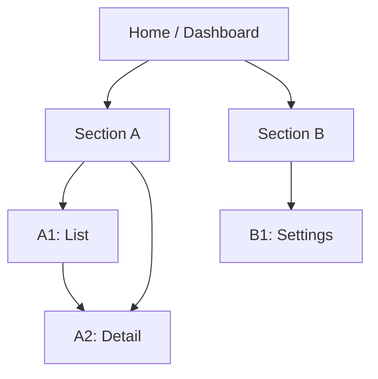

# UX Architecture Templates (navigation, data flows, cognitive load)

Use these templates during **Step 2** (scope discovery) to avoid polishing UI that is structurally confusing.

## 1) North-star tasks (what users come here to do)

Capture 3–7 tasks. Keep them concrete and phrased as outcomes.

- T1: [verb + object] in [context] (e.g. “Create an incident review in 2 minutes after an outage”)
- T2: …

For each task, record:

- **Primary surface(s)**:
- **Inputs** (data/user actions):
- **System outputs**:
- **Pain** (today):
- **Success** (how user knows it worked):

## 2) Information Architecture + Navigation Map

Goal: make “where am I / where can I go next” obvious, without adding cognitive overhead.

### IA snapshot

- **Top-level sections** (left nav / tabs): [A, B, C…]
- **Depth**: max depth should be 2–3 for most apps (beyond that, rely on search, breadcrumbs, or contextual nav)
- **Naming**: labels match user mental model (avoid internal system names)

### Navigation rules

- **Primary nav changes rarely**; secondary nav is contextual.
- Prefer **progressive disclosure** over showing every option at once.
- Any nav change must preserve: deep links, browser back, refresh safety.

### Map template (Mermaid)

## 3) Data Flow + State Coverage Map

Goal: ensure the UI matches the actual data model and async behavior (loading/empty/error), and does not hide complexity in surprising places.

### Data entities (minimal list)

- **Entity**: [name]
  - **Source**: [API/DB/local storage/in-memory]
  - **Owner**: [service/module]
  - **Primary operations**: [create/read/update/delete]
  - **Key states**: [pending/success/failure/empty/partial]
  - **UI surfaces**: [pages/components]

### Interaction → data flow table

| User action | UI surface | Request(s) | State(s) | Success feedback | Failure recovery |
|------------|------------|------------|----------|------------------|------------------|
| Create X | /x/new | POST /x | submitting → success | toast + redirect | inline error + retry |

### Failure-mode prompts (answer for key flows)

- What happens if the user refreshes mid-flow?
- What happens if the network is slow (1–3s latency)?
- What happens if permissions are missing?
- What happens if data is empty/new user?

## 4) Cognitive Load + Complexity Budget

Goal: reduce “reading, choosing, remembering” cost for core tasks.

### Complexity budget (choose targets)

- **Choices per view**: prefer ≤ 7 primary choices visible at once for novice paths.
- **Primary CTA count**: 1 per view (plus 1–2 secondary).
- **Density**: match audience (operators can handle higher density; consumers generally cannot).

### Overload signals (log if present)

- Too many controls with equal visual weight (no hierarchy).
- Repeated jargon; labels require prior knowledge.
- Critical controls only available on hover.
- Long forms without chunking/progress.
- No defaults; user must configure everything before doing anything.

### Simplification tactics (choose the smallest that works)

- Progressive disclosure (advanced options collapsed).
- Better defaults + smart prefill.
- Chunking + step indicators for long flows.
- Inline examples and constraints (near the field, not in docs).
- Fewer variants (remove “almost the same” options).

## 5) Inspiration Scan (principles, not copying)

Pick 2–3 comparable products and extract *why users like them*.

For each product:

- **What it optimizes for**: speed | clarity | flexibility | trust | delight
- **Navigation pattern**: sidebar | tabs | command palette | search-first
- **Information density**: low/medium/high and why it works
- **Micro-interactions**: feedback, loading, error recovery
- **What not to copy**: brand assets, exact layout, proprietary interactions

Common reference archetypes (examples only):

- High-density operator UIs: Linear, GitHub, Stripe Dashboard
- Flexible builders: Notion, Figma
- Communication flows: Slack, Discord
- Consumer onboarding: Airbnb, Duolingo
