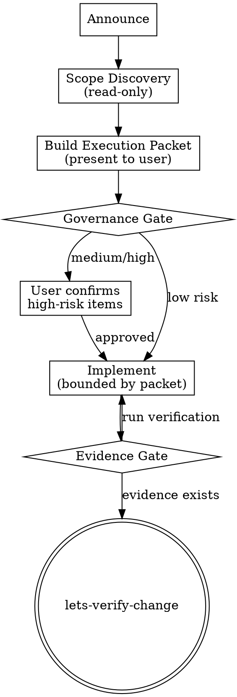

> **Note:** This is the standalone version. For letsbe10x runtime augmentation (context pre-flight, governance, pack enrichment), use the `l10x` profile from [skill-overlay](https://github.com/letsbe10x/skill-overlay).

# lets-develop-feature

Plan, gate, and implement a code change with structured governance and evidence-gated handoff.

## Process Flow



## When to use

- AI agent is about to implement a change and needs governance before coding
- Developer wants a structured execution packet before implementation begins
- Part of a `pr-ship` workflow: lets-develop-feature → lets-verify-change → lets-review-code
- A change touches multiple files, shared interfaces, or critical paths

## When not to use

- You only need to verify an existing change (use `lets-verify-change` directly).
- You are reviewing a PR without implementing anything (use `lets-review-pr`).
- The change is a single-line typo fix with zero risk (just fix it directly).

## Inputs

- Input: Task description, spec, or approved plan
- Input: Repo root path
- Input: List of changed or planned file paths (optional — discovered in Phase 1 if not provided)

---

## Step 1 — Announce

**This step is mandatory. Do it BEFORE any file reads or exploration.**

State: "I'm using lets-develop-feature to implement this change."

Do not skip this. Do not proceed to reading files without announcing first.

---

## Step 2 — Scope Discovery (read-only)

Before building the execution packet, gather evidence about what you're changing.

1. **Identify target files** — from the task description, spec, or by exploring the codebase.

2. **Read each target file** and scan for risk signals:

   | Signal | How to detect | Meaning |
   |--------|---------------|---------|
   | Critical path marker | Docstring contains "CRITICAL", "security review", "do not modify without" | High risk — requires individual confirmation |
   | Shared interface | File is imported by 3+ other modules (check with grep) | Medium risk — changes propagate |
   | Configuration file | Lives in `config/`, `.env`, or is named `*.yaml`/`*.toml`/`*.json` with cross-cutting settings | Medium risk — affects multiple subsystems |
   | Irreversible operation | Task involves DROP, DELETE, migration, or external API call | High risk — cannot be undone |
   | Test file only | File lives in `tests/` or `test_*` | Low risk |
   | New file (additive) | File doesn't exist yet | Low risk |

3. **Check who imports each file** (for existing files):
   ```bash
   grep -r "from .module_name import\|import module_name" --include="*.py" .
   ```

4. **Output**: A file manifest with risk annotations. Example:
   ```
   Files in scope:
   - src/permissions.py — MEDIUM (shared interface, imported by api.py, admin.py, middleware.py)
   - src/auth.py — HIGH (docstring: "CRITICAL PATH", security-sensitive)
   - config/roles.yaml — MEDIUM (cross-cutting config)
   - src/api.py — LOW (additive: new endpoint)
   - tests/test_permissions.py — LOW (test file)
   ```

**Do not proceed to the execution packet without completing scope discovery.**

---

## Step 3 — Build the Execution Packet

Present the following structured packet to the user. Every field is mandatory.

```markdown
## Execution Packet

**Task:** [one-sentence description of what this change accomplishes]

**Risk Level:** Low | Medium | High
**Risk Evidence:**
- [cite specific signals from scope discovery, e.g., "auth.py docstring says CRITICAL PATH"]
- [e.g., "permissions.py imported by 4 modules — shared interface"]

### Work Packages (ordered lowest-risk first)

| # | Files | Intent | Verification | Risk |
|---|-------|--------|--------------|------|
| 1 | tests/test_new.py | Write failing tests first | `pytest tests/test_new.py` — should fail | Low |
| 2 | src/new_module.py | Implement new additive logic | `pytest tests/test_new.py` — should pass | Low |
| 3 | src/shared.py | Modify shared interface | `pytest tests/ -q` — all pass | Medium |
| 4 | config/settings.yaml | Update configuration | Manual review | Medium |

### Critical Path Files (require individual confirmation)
- src/auth.py — "CRITICAL PATH" marker in docstring. Confirm before editing? (y/n)
```

**Hard rules for the execution packet:**
- Work packages are ordered **lowest risk first** — complete safe changes before risky ones.
- Every work package has a verification command. No package without a way to check it.
- Critical path files are listed separately with an explicit confirmation request.
- If you cannot identify verification commands, ask the user what tests/checks exist.

**Do not proceed to implementation without presenting this packet.**

---

## Step 4 — Governance Gate

After presenting the execution packet, apply the governance decision:

| Overall Risk Level | Action |
|-------------------|--------|
| **Low** | All files are additive or test-only. State "Low risk — proceeding with implementation." and continue. |
| **Medium** | Shared interfaces or config touched. State the specific risks, then ask: "Acknowledge these risks and proceed? (y/n)" |
| **High** | Critical paths, irreversible operations, or security surfaces. Present a mitigation plan (e.g., "I'll implement behind a feature flag" or "I'll add a rollback migration"). Ask: "Confirm proceed with mitigation? (y/n)" |

**For each critical-path file**, ask individually:
> "This file is in a critical path — proceed with editing [filename]? (y/n)"

Wait for explicit confirmation before editing critical-path files.

---

## Step 5 — Implement (bounded by packet)

After governance is cleared, implement each work package in order:

1. Read target files before editing
2. Make the change as specified in the work package
3. Run the verification command listed for that package
4. If verification fails, fix before moving to the next package
5. Move to the next work package

**Scope enforcement:**
- Do NOT implement changes to files not listed in the execution packet.
- If you discover additional files need changes, STOP and say: "I need to update the execution packet — [file] also needs modification because [reason]. Proceed?"
- Only continue after user confirms the expanded scope.

---

## Step 6 — Evidence Gate and Handoff

Before handoff, you MUST have at least one concrete verification artifact:

- A passing test run output (preferred)
- A lint/type-check result
- A build artifact or successful compilation

**Do not say "it should pass" — that is not evidence. Run the command.**

```bash
# Confirm the change surface
git diff --stat HEAD

# Run verification
pytest tests/ -q  # or the project's test command
```

Present the evidence, then invoke `lets-verify-change`.

---

## Anti-patterns

- **Implementing before presenting the execution packet** — the packet gates implementation. No packet, no coding.
- **Saying "this is low risk" without citing evidence** — risk classification must reference specific signals from scope discovery (docstring markers, import count, file type).
- **Skipping critical-path confirmation** — every file with a critical-path signal requires individual "proceed?" confirmation. No exceptions.
- **Modifying files not in the execution packet** — if you discover new scope, stop and update the packet. Do not silently expand.
- **Handing off without running verification** — you must have executed at least one command and shown its output before invoking lets-verify-change.
- **Committing secrets, tokens, or credentials** — never commit secrets. Use environment variables or secret managers.
- **Ordering work packages highest-risk first** — do safe changes first. If a risky change breaks something, the safe changes already committed still work.

## Context sufficiency check

For trivial changes (single test file edit, adding a comment, fixing a typo in a non-critical file), the execution packet can be minimal:

```markdown
## Execution Packet
**Task:** Fix typo in README
**Risk Level:** Low
**Risk Evidence:** Single documentation file, no importers, no runtime effect.

| # | Files | Intent | Verification | Risk |
|---|-------|--------|--------------|------|
| 1 | README.md | Fix typo | Visual review | Low |
```

The packet is still required — it's just short. This prevents the skill from being bypassed on "simple" changes while keeping overhead proportional.

---

## Outputs

- Output: File manifest with risk annotations (from scope discovery)
- Output: Structured execution packet with work packages
- Output: Governance decision with cited evidence
- Output: Implemented changes with verification evidence
- Output: Handoff to lets-verify-change

Done when: execution packet is presented, governance is cleared, all work packages are implemented with verification, and handoff is ready.
