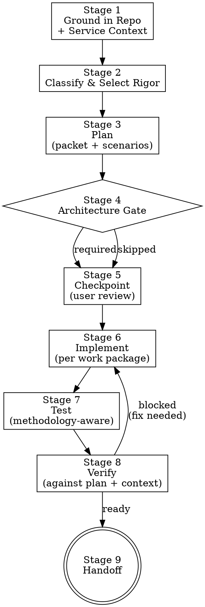

> **Note:** This is the standalone version. For letsbe10x runtime augmentation (context pre-flight, governance, pack enrichment), use the `l10x` profile from [skill-overlay](https://github.com/letsbe10x/skill-overlay).

# lets-develop-feature

Full-lifecycle feature development with staged execution and artifact discipline. Every stage has explicit state (completed/skipped/blocked). Service context constraints bind the entire run. Changes are verified against the plan, not just "do tests pass."

## Process Flow



## Stage State Machine

Every stage tracks explicit state. No implicit stages.

| State | Meaning |
|-------|---------|
| `pending` | Stage not yet started |
| `in_progress` | Stage actively being worked |
| `completed` | Stage finished with artifacts produced |
| `skipped` | Stage explicitly not needed (with reason) |
| `blocked` | Stage cannot proceed (with blocker description) |

**Rule:** Optional stages (architecture, integration tests) must be explicitly marked `skipped` — never left as `pending` at handoff.

---

## When to use

- Implementing a feature, bugfix, or refactor that touches production code
- Any change that benefits from structured planning before coding
- Part of the delivery chain: **lets-develop-feature** → lets-verify-change → lets-review-code
- When service constraints and critical paths must be preserved

## When not to use

- Verifying an existing change (use `lets-verify-change`)
- Reviewing a PR (use `lets-review-pr`)
- Single-line typo fix with zero risk (just fix it directly)
- Research/discovery without implementing (use `lets-brainstorm`)

## Inputs

- Input: Task description, spec, ticket, or approved plan
- Input: Repo root path
- Input: Priority/urgency signal (optional — affects rigor level)

---

## Stage 1 — Ground in Repo + Service Context

**This stage is NEVER skipped.** Read the repo's guidance and constraints before any decision.

### Read Repo Guidance

```bash
cat AGENTS.md 2>/dev/null
cat CLAUDE.md 2>/dev/null
cat README.md 2>/dev/null | head -80
```

### Read Service Context

Service context contains non-negotiables and critical paths. When present, it BINDS the entire run.

**What to extract:**

| Context area | What to look for | How it constrains the run |
|-------------|------------------|--------------------------|
| **Non-negotiables** | Things that must NEVER change (security invariants, data contracts, API guarantees) | Implementation must preserve these — violation = BLOCK |
| **Critical paths** | Code paths that must NEVER break (auth, payments, data integrity) | Extra verification required when touched |
| **Architecture boundaries** | Module ownership, dependency direction, layer discipline | Implementation must respect these |
| **Rollout posture** | How this system deploys (feature flags, canary, blue-green) | Affects how you structure the change |
| **Testing expectations** | What the maintainer expects verified (unit, integration, e2e) | Drives methodology selection |

```bash
# From AGENTS.md, extract:
# - Security invariants
# - Module boundaries
# - Testing requirements
# - Deployment constraints

# From existing code, infer:
git log --oneline -10
find . -maxdepth 2 -type d | grep -v node_modules | grep -v .git | head -30
find . -path "*/test*" -name "*.py" -o -path "*/test*" -name "*.ts" | head -10
```

### Produce Service Context Summary

```markdown
## Service Context (binds this run)

**Non-negotiables:**
- [invariant from AGENTS.md that cannot be violated]

**Critical paths touched by this change:**
- [path]: [why it's critical]

**Architecture boundaries:**
- [boundary rule from AGENTS.md]

**Testing expectations:**
- [what the repo expects verified]

**Rollout constraints:**
- [how to structure the change for safe deployment]
```

**Stage 1 status: `completed`**

---

## Stage 2 — Classify & Select Rigor

See [references/CLASSIFICATION.md](references/CLASSIFICATION.md) for the full decision matrix.

### Quick Classification

| Dimension | Value |
|-----------|-------|
| **Type** | feature / bugfix / refactor / performance / migration / config |
| **Scale** | trivial / small / medium / large |
| **Risk** | low / medium / high / critical |
| **Complexity** | mechanical / moderate / complex / gnarly |

### Rigor Selection

| Rigor | Trigger | Stages required |
|-------|---------|-----------------|
| **MINIMAL** | Trivial + low risk + mechanical | Ground → Plan (minimal) → Implement → Verify (quick) → Handoff |
| **STANDARD** | Small-medium, typical work | All stages, architecture may be skipped |
| **ELEVATED** | Cross-module, new abstractions, API changes | All stages mandatory, architecture required |
| **FULL** | Large, critical, irreversible | All stages + user checkpoints + stacked PRs |

### Gate Overrides (force rigor escalation)

| Gate | Trigger | Effect |
|------|---------|--------|
| Security | Touches auth/crypto/secrets | ELEVATED minimum |
| Architecture | New abstraction, boundary change | Architecture stage opens |
| Migration | Schema/data changes | ELEVATED minimum |
| API | Public interface change | Architecture stage opens |
| Service context | Touches a non-negotiable or critical path | Extra verification, explicit preservation proof |

State classification:
> **Classification:** bugfix / small / medium-risk / STANDARD
> **Gates triggered:** service_context (touches critical path: auth middleware)
> **Architecture stage:** skipped (no structural decisions, just logic fix)

**Stage 2 status: `completed`**

---

## Stage 3 — Plan

Produce the execution packet, scenario matrix, and supporting artifacts.

### Execution Packet (mandatory)

See [assets/templates/execution-packet.template.md](assets/templates/execution-packet.template.md).

```markdown
## Execution Packet

**Task:** [one-sentence]
**Classification:** [type / scale / risk / rigor]
**Branch:** [branch name]
**Service constraints:** [non-negotiables this run must preserve]

### Work Packages (lowest risk first)

| # | Files | Intent | Verification | Risk | Methodology |
|---|-------|--------|--------------|------|-------------|
| 1 | ... | ... | `command` | Low | TDD |
| 2 | ... | ... | `command` | Medium | Test-after |

### Critical Path Files
- [file] — [why critical] — Mitigation: [plan]

### Scope Boundary
IN: [list]
OUT: [list, explicitly deferred]
```

### Scenario Matrix (STANDARD+ rigor)

| Scenario | Type | Input | Expected | Covered by |
|----------|------|-------|----------|-----------|
| [Happy path] | happy | [input] | [expected behavior] | Work package #2 |
| [Invalid input] | failure | [bad input] | [error handling] | Work package #3 |
| [Boundary case] | edge | [edge input] | [expected] | Work package #3 |
| [Concurrent access] | edge | [race condition] | [safe behavior] | Work package #4 |

### Assumptions & Edge Cases (STANDARD+ rigor)

```markdown
### Assumptions
- [assumption]: [why we believe this is true]
- [assumption]: [consequence if wrong]

### Deferred Edge Cases
- [case]: [why deferred] — will address in [follow-up ticket/PR]

### Open Questions
- [question]: [what we'd need to know to resolve]
```

### Decision Log (ELEVATED+ rigor)

| Decision | Chosen | Alternatives | Tradeoff | Rationale |
|----------|--------|-------------|----------|-----------|
| [what] | [approach] | [what else] | [cost of chosen] | [why chosen wins] |

**Stage 3 status: `completed`**

---

## Stage 4 — Architecture Gate

See [references/ARCHITECTURE-GATE.md](references/ARCHITECTURE-GATE.md) for the full protocol.

### When it Opens

- New module, class, or abstraction introduced
- Cross-module boundary change
- Public API surface change
- Persistence/schema change
- Dependency direction change

### When it Doesn't Open

Mark **explicitly as `skipped`** with reason:
> Architecture stage: `skipped` — no structural decisions, mechanical change within existing patterns.

### Gate Protocol (when open)

1. Answer the 6 architecture questions (placement, boundary, abstraction, contracts, extensibility, alternatives)
2. Produce `architecture_notes` in the decision log
3. Document tradeoffs and boundary reasoning
4. Present to user for approval (interactive) or document and proceed (autonomous)

**Stage 4 status: `completed` | `skipped` (reason: ...)**

---

## Stage 5 — Checkpoint (User Review)

**For MINIMAL rigor:** Skip (mark `skipped`).
**For STANDARD+:** Present the execution packet for approval.

### Checkpoint Presentation

> **Checkpoint: Ready to implement.**
>
> **What:** [task summary]
> **Approach:** [key design decision]
> **Packages:** [N work packages, lowest-risk first]
> **Key risk:** [main concern and mitigation]
> **Scenarios:** [N happy + N failure + N edge cases covered]
>
> Proceed with implementation?

### Checkpoint Quality Checklist

- [ ] Scope clear and bounded?
- [ ] Insertion points grounded in actual code?
- [ ] Scenarios cover happy + failure + edge?
- [ ] Verification commands ready for each package?
- [ ] Unknowns and assumptions explicit?
- [ ] Service context constraints acknowledged?
- [ ] Architecture decision documented (or explicitly skipped)?

**Stage 5 status: `completed` | `skipped` (MINIMAL rigor)**

---

## Stage 6 — Implement (Per Work Package)

Execute work packages one at a time, in order. See [references/METHODOLOGY.md](references/METHODOLOGY.md).

### Per-Package Protocol

1. **Claim** — "Implementing package N: [intent]"
2. **Read** — read all target files before editing
3. **Check service constraints** — will this edit violate a non-negotiable or break a critical path?
4. **Implement** — make the change
5. **Verify** — run declared verification command
6. **Update artifacts** — keep traceability and implementation notes current
7. **Proceed or fix** — if fail, fix before next package

### Implementation Discipline

| Rule | Enforcement |
|------|-------------|
| Read before write | Never edit a file without reading it first |
| Service context binding | Every edit checked against non-negotiables |
| Scope enforcement | New files → STOP, update packet, get approval |
| Error handling preservation | Never weaken existing error handling |
| Pattern alignment | Follow existing repo patterns (nearest AGENTS.md wins) |
| Artifact currency | Update traceability.md as you implement |
| Contract preservation | Preserve caller-visible interfaces unless plan explicitly changes them |

### Scope Enforcement (HARD STOP)

If you discover additional files need changes:

```
STOP. 
"I need to expand scope — [file] needs modification because [reason].
This changes risk from [X] to [Y]. Updated scope:
  + [new file]: [why needed]
Proceed with expanded scope?"
```

**Do NOT silently expand. Ever.**

### Living Artifacts

These artifacts are updated DURING implementation, not just at the end:

| Artifact | Update when |
|----------|------------|
| **Traceability** | Each package maps requirement → code → test |
| **Implementation notes** | Critical paths touched, non-negotiables preserved, concerns |
| **Decision log** | Any new tradeoff encountered during coding |
| **Assumptions** | Any assumption proven wrong or new assumption discovered |

**Stage 6 status: `completed` (packages X/Y done)**

---

## Stage 7 — Test

See [references/METHODOLOGY.md](references/METHODOLOGY.md) for methodology selection.

### Test Strategy (per package)

| Methodology | When | Protocol |
|-------------|------|----------|
| **TDD** | New behavior with clear criteria | Failing test → implement → pass |
| **Test-after** | Modifying existing code with existing tests | Implement → verify existing → add gap tests |
| **Integration** | API/endpoint/cross-module wiring | Implement → integration test → verify e2e |
| **Manual** | Config/build/deploy changes | Implement → run command → verify output |

### Test Quality Bar

Tests must:
- Assert behavior (not just "didn't throw")
- Cover scenarios from the scenario matrix
- Exercise critical paths identified in service context
- Be independent (no order dependency)
- Use descriptive names

### Test Stage Closure

```bash
# Run relevant tests
pytest tests/ -q  # or project test command

# Record results
echo "Tests: X passed, Y failed"
```

If tests fail on unchanged code (pre-existing failure): note as pre-existing, do not fix (out of scope unless in packet).

**Stage 7 status: `completed` | `skipped` (reason: test-only change, tests are the deliverable)**

---

## Stage 8 — Verify (Against Plan + Service Context)

**This is a DEDICATED verification stage — not just "run tests again."**

### Verification Protocol

Compare the delivered work against:

1. **The execution packet** — did we implement what was planned?
2. **The scenario matrix** — are all scenarios covered?
3. **Service context constraints** — are non-negotiables preserved? Critical paths unbroken?
4. **Architecture decisions** — were they followed as documented?
5. **Scope boundary** — did we stay in scope?

### Verification Checklist

| Check | Evidence | Status |
|-------|----------|--------|
| All work packages completed | Traceability record | pass/fail |
| Tests pass | `pytest` output | pass/fail |
| Lint clean | `ruff check` output | pass/fail |
| Non-negotiables preserved | Code inspection | pass/fail |
| Critical paths unbroken | Tests covering critical paths pass | pass/fail |
| Scope respected | diff matches packet file list | pass/fail |
| No weakened error handling | Diff inspection | pass/fail |
| Architecture decisions followed | Code matches design notes | pass/fail |

### Verification Commands

```bash
# Full test suite
pytest tests/ -q

# Lint
ruff check src/ 2>&1 || true

# Type check (if applicable)
mypy src/ 2>&1 || true

# Diff matches scope
git diff --stat
git diff --name-only  # compare against packet file list
```

### Verification Verdict

| Verdict | Criteria | Action |
|---------|----------|--------|
| **ready** | All checks pass, service constraints preserved | Proceed to handoff |
| **blocked** | Check failed, constraint violated, or evidence missing | Fix and re-verify |

State clearly:
> **Verification: ready** — all packages implemented, tests pass, non-negotiables preserved, scope respected.

or:

> **Verification: blocked** — critical path test `test_auth_flow` failing after change to middleware. Fix required before handoff.

**Stage 8 status: `completed` (verdict: ready | blocked)**

---

## Stage 9 — Handoff

See [references/HANDOFF.md](references/HANDOFF.md) for the full protocol.

### Handoff Packet

```markdown
## Handoff: lets-develop-feature → lets-verify-change

**Task:** [what was implemented]
**Rigor:** [level]
**Verification verdict:** ready

### Stage Status
| Stage | Status |
|-------|--------|
| Ground | completed |
| Classify | completed |
| Plan | completed |
| Architecture | completed / skipped: [reason] |
| Checkpoint | completed / skipped: [reason] |
| Implement | completed (X/Y packages) |
| Test | completed |
| Verify | completed (ready) |

### Evidence
- Tests: [X passed, 0 failed]
- Lint: [clean]
- Critical paths: [preserved — evidence: test_auth_flow passes]

### Verification Commands
```bash
pytest tests/ -q
ruff check src/
```

### Service Constraints Honored
- [non-negotiable]: preserved — [evidence]
- [critical path]: unbroken — [evidence]

### Concerns for Downstream
- [anything the verifier should double-check]
```

**Stage 9 status: `completed`**

---

## Negative Guardrails (What I REFUSE To Do)

These are hard stops, not suggestions:

| Guardrail | Rationale |
|-----------|-----------|
| **I will NOT implement before presenting the execution packet** | Packet gates implementation. No packet, no coding. |
| **I will NOT expand scope without stopping and asking** | Silent scope expansion is the #1 drift mechanism. |
| **I will NOT weaken existing error handling** | Swallowing errors makes systems harder to debug. |
| **I will NOT ignore service context constraints** | Non-negotiables are non-negotiable. Violation = block. |
| **I will NOT fabricate test results** | "It should pass" is not evidence. Run the command. |
| **I will NOT leave optional stages implicit** | Every stage is `completed` or explicitly `skipped` with reason. |
| **I will NOT commit secrets** | Tokens, keys, credentials never go in code. |
| **I will NOT re-plan inside implementation** | If the plan is wrong, stop and update it. Don't silently deviate. |
| **I will NOT skip reading files before editing them** | Context prevents mistakes. |
| **I will NOT treat architecture decisions as optional for structural changes** | Design errors compound. Catch them before coding. |
| **I will NOT approve my own work without running verification** | Evidence before assertions. Always. |
| **I will NOT soften findings or claim confidence I don't have** | Explicit residual risk > implied confidence. |

---

## Graduated Rigor — Quick Reference

### MINIMAL (trivial + low risk)
- Stages: Ground → Classify → Plan (one-liner) → Implement → Verify (quick) → Handoff
- Skip: Architecture, Checkpoint, Scenario matrix, Decision log, Traceability
- Artifact: Minimal packet + test output

### STANDARD (typical feature/bugfix)
- Stages: All stages, Architecture may be skipped
- Artifacts: Full packet + scenario matrix + assumptions + verification record
- Decision log: optional (only if meaningful tradeoffs)

### ELEVATED (structural changes, high risk)
- Stages: All stages mandatory (Architecture REQUIRED)
- Artifacts: All + decision log + architecture notes + traceability
- Checkpoint: User must approve before implementation
- Stacked PRs: considered for >500 LOC

### FULL (critical, irreversible, multi-system)
- Stages: All stages + per-critical-file confirmation
- Artifacts: All + per-package evidence + full traceability
- Checkpoint: User must approve plan + architecture
- Stacked PRs: required for >500 LOC
- Verification: comparison against every service constraint

---

## Outputs

- Output: Service context summary (non-negotiables, critical paths)
- Output: Change classification (type, scale, risk, rigor)
- Output: Execution packet with work packages and scenarios
- Output: Architecture notes (or explicit skip with reason)
- Output: Per-package verification evidence
- Output: Traceability record (requirement → code → test)
- Output: Verification verdict (ready | blocked) with evidence
- Output: Stage status table (all stages accounted for)
- Output: Handoff to lets-verify-change

Done when: all stages have explicit terminal status, verification verdict is `ready`, service constraints are preserved with evidence, and handoff packet is produced.
