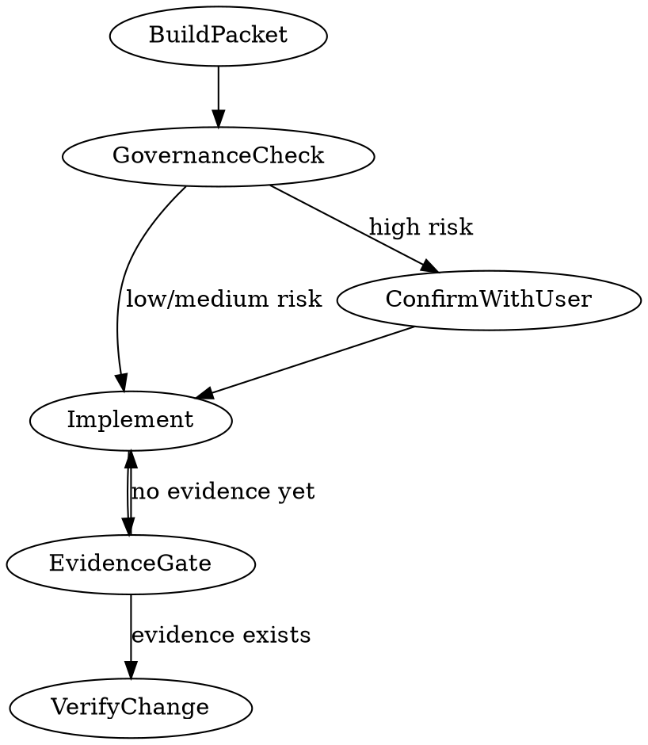

> **Note:** This is the standalone version. For letsbe10x runtime augmentation (context pre-flight, governance, pack enrichment), use the `l10x` profile from [skill-overlay](https://github.com/letsbe10x/skill-overlay).

# lets-develop-feature

Plan and gate a code change before implementation begins, then implement it with evidence-gated handoff to verification.

## When to use

- AI agent is about to implement a change and needs an execution packet and governance check
- Developer wants a structured change plan before coding begins
- Part of a `pr-ship` workflow: lets-develop-feature → lets-verify-change → lets-review-code

## When not to use

- You only need to verify an existing change (use `lets-verify-change` directly).
- You are reviewing a PR without implementing anything (use `lets-review-pr`).

## Inputs

- Input: List of changed or planned file paths
- Input: Repo root path
- Input: Approved spec or task description (optional but recommended)

---

## Phase 1 — Identify changed paths

Before beginning, determine which files are in scope for this change.

**Option A — explicit paths (preferred when known):**
```bash
# List the files you intend to change, e.g.:
git diff --name-only HEAD
# or list them explicitly: src/foo.py src/bar.py
```

**Option B — from staged changes:**
```bash
git diff --name-only HEAD
```

If no changed paths are available yet (greenfield work), proceed with an empty list and note that this is a greenfield change.

---

## Phase 2 — Build the execution packet

Read the spec or task description and produce an execution packet — a structured plan covering:

- `task` — description of the change to implement
- `work_packages` — ordered list of implementation units with file targets
- `verification_commands` — commands to run after implementation

For each work package, specify:
- `files` — files to create or modify
- `intent` — what the unit accomplishes
- `verification_commands` — commands to run after this unit is complete

Review the planned change against any known non-negotiables or critical paths in the repo. If the change touches a critical file or path, confirm with the user before proceeding: "This file appears to be in a critical path — proceed? (y/n)"

---

## Phase 3 — Governance check

Before implementing, assess the risk of the planned change:

| Risk level | Meaning | Action |
|---------|---------|--------|
| Low | Additive changes, no external side effects | Proceed to implementation |
| Medium | Changes to shared interfaces or configurations | Proceed with documented acknowledgment |
| High | Irreversible mutations, external side effects, security surface | Confirm with user before proceeding |

If the change involves irreversible mutations, dependency changes, or external side effects, present these to the user and ask for confirmation before proceeding.

---

## Phase 4 — Implement the change

After reviewing the execution packet, implement each work package in order:

1. Read the target files before editing (`Read` tool or equivalent)
2. Make the change as specified in the work package
3. Run any `verification_commands` listed for that work package
4. Move to the next work package

Do not skip work packages. Do not implement changes not listed in the execution packet without user confirmation.

---

## Before invoking lets-verify-change

Confirm you have at least one of:
- A passing test run output
- A lint result
- A build artifact

Do not invoke `lets-verify-change` and say "it should pass" — that is not evidence.

## Phase 5 — Handoff to lets-verify-change

When implementation is complete, hand off to `lets-verify-change`:

```bash
# Run the test suite before handing off — verify first
git diff --stat HEAD  # confirm the change surface
```

Then invoke `lets-verify-change`.

---

## Outputs

- Output: Execution packet with task list
- Output: Implemented changes ready for verification
- Output: Handoff to lets-verify-change with at least one piece of verification evidence

## Example

```bash
# Confirm change surface before verification handoff
git diff --name-only HEAD
# Then run tests
uv run pytest tests -q
```

## Anti-patterns

- **Implementing outside the execution packet without explicit confirmation** — the governance packet defines scope. Anything not in the packet is out of scope.
- **Handing off to lets-verify-change without running any local check** — you must have at least one piece of verification evidence before handoff.
- **Committing secrets, tokens, or credentials to the repository** — blocked. Never commit secrets; use environment variables or secret managers instead.

## Process



## Hard rules

- Never implement changes that are not described in the execution packet without user confirmation.
- Before editing any file identified as critical, confirm with the user that the change is intentional. Ask: "This file is in a critical path — proceed? (y/n)"

Done when: the execution packet is generated, implementation is complete with at least one verification evidence item, and handoff to lets-verify-change is ready.
