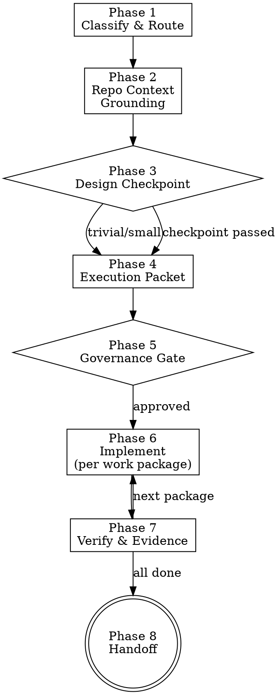

> **Note:** This is the standalone version. For letsbe10x runtime augmentation (context pre-flight, governance, pack enrichment), use the `l10x` profile from [skill-overlay](https://github.com/letsbe10x/skill-overlay).

# lets-develop-feature

Full-lifecycle feature development with graduated rigor. Classifies the change, grounds in repo context, gates architecture decisions, implements with methodology-aware discipline, and produces evidence-gated handoff to verification.

## Process Flow



## When to use

- Implementing a feature, bugfix, or refactor that touches production code
- A change that benefits from structured planning before coding
- Part of the delivery chain: **lets-develop-feature** → lets-verify-change → lets-review-code
- When you need architecture awareness before making structural decisions

## When not to use

- You only need to verify an existing change (use `lets-verify-change`)
- You are reviewing a PR (use `lets-review-pr`)
- The change is a single-line typo fix with zero risk (just fix it directly)
- You are doing discovery/research without implementing (use `lets-brainstorm`)

## Inputs

- Input: Task description, spec, ticket, or approved plan
- Input: Repo root path
- Input: Priority/urgency signal (optional — affects rigor level)

---

## Phase 1 — Classify & Route

Determine the change's characteristics to select the appropriate rigor level.

```bash
# Understand what we're working with
cat AGENTS.md 2>/dev/null | head -50
git log --oneline -5
git status
```

### Change Classification

| Dimension | Options |
|-----------|---------|
| **Type** | feature / bugfix / refactor / performance / migration / config |
| **Scale** | trivial (<20 LOC, 1-2 files) / small (20-100 LOC) / medium (100-500 LOC) / large (>500 LOC or >10 files) |
| **Risk** | low / medium / high / critical |
| **Complexity** | mechanical / moderate / complex / gnarly |

### Graduated Rigor Selection

| Rigor | When | What it means |
|-------|------|---------------|
| **MINIMAL** | Trivial: config fix, typo, test-only, <20 LOC with no risk signals | Minimal packet, skip design checkpoint, fast verification |
| **STANDARD** | Small-to-medium: typical feature/bugfix within one module | Full packet, test plan, per-package verification |
| **ELEVATED** | Medium-to-large: cross-module, new abstractions, API changes | Design checkpoint mandatory, architecture gate, stacked PRs considered |
| **FULL** | Large or critical: multi-system, security-touching, irreversible ops | Design checkpoint + user approval, architecture review, per-package evidence, explicit traceability |

### Risk Signals

Scan the task description and target files for:

| Signal | Risk level | Detection |
|--------|-----------|-----------|
| Security/auth code | HIGH | Files named `auth`, `security`, `crypto`, `permission` |
| Database migration | HIGH | `migrations/`, `schema`, `ALTER TABLE`, `DROP` |
| Public API change | HIGH | Route definitions, OpenAPI specs, exported interfaces |
| Shared interface modification | MEDIUM | File imported by 3+ modules |
| Cross-module boundary | MEDIUM | Changes span multiple top-level directories |
| External side effects | HIGH | HTTP calls, queue publishing, email sending |
| Irreversible operations | CRITICAL | DELETE, DROP, data destruction, external state changes |
| New dependency | MEDIUM | New imports, package.json/pyproject.toml changes |
| Concurrency patterns | MEDIUM | async/threads/locks/queues |

State classification:
> **Classification: STANDARD** — small bugfix (60 LOC, 3 files), touches business logic, no critical path signals.

---

## Phase 2 — Repo Context Grounding

Resolve repo context ONCE and carry it through all subsequent phases.

```bash
# Read repo guidance
cat AGENTS.md 2>/dev/null
cat CLAUDE.md 2>/dev/null

# Understand structure
find . -maxdepth 2 -type d | grep -v node_modules | grep -v .git | grep -v __pycache__ | head -30

# Understand testing conventions
find . -path "*/test*" -name "*.py" -o -path "*/test*" -name "*.ts" | head -10

# Understand recent patterns
git log --oneline -10
```

### Context Brief (carry forward)

Produce a mental model covering:

1. **Repo kind** — service / library / CLI / monorepo
2. **Architecture** — module boundaries, layer structure, dependency rules
3. **Invariants** — from AGENTS.md: what must never be violated
4. **Testing** — how does this repo test? (pytest/jest/go test? unit/integration/e2e? fixtures?)
5. **Standards** — coding conventions, naming, error handling patterns
6. **Critical paths** — which areas require extra care
7. **Build/run** — how to run tests, lint, build

### Identify Target Files

```bash
# From spec or task, identify files to change
# Read each and scan for risk markers
grep -rn "CRITICAL\|DO NOT MODIFY\|security review required" <target_files>

# Check importers (blast radius)
grep -rn "from.*<module>.*import\|import.*<module>" --include="*.py" .
```

Output a file manifest:
```
Files in scope:
- src/auth/middleware.py — HIGH (CRITICAL PATH marker, security-sensitive)
- src/api/routes.py — MEDIUM (shared: imported by 5 modules)
- src/models/user.py — LOW (additive: new field)
- tests/test_auth.py — LOW (test file)
```

---

## Phase 3 — Design Checkpoint

**Skip for MINIMAL rigor.** Required for ELEVATED and FULL. Recommended for STANDARD when complexity > moderate.

### When to Open the Design Checkpoint

The design checkpoint activates when ANY of these are true:
- New abstraction being introduced (class, module, interface)
- Cross-module boundary change
- Public API surface change (new endpoint, schema change, breaking change)
- Persistence/schema change
- New dependency or framework integration
- Ownership or dependency-direction change

### Architecture Gate Questions

Before coding, answer:

1. **Placement:** Does this belong in the module where I'm putting it? (responsibility check)
2. **Boundary:** Does this change respect existing module boundaries? (coupling check)
3. **Abstraction:** Is the abstraction level right? Not premature, not missing? (fit check)
4. **Contracts:** Am I changing any public interface? If so, is it backward-compatible? (compatibility check)
5. **Extensibility:** Will known upcoming work fit without rewriting this? (future-proofing check)
6. **Alternatives:** Did I consider simpler approaches? (over-engineering check)

### Design Decision Record

For ELEVATED/FULL rigor, document key decisions:

```markdown
### Design Decisions

| Decision | Chosen approach | Alternatives considered | Rationale |
|----------|----------------|----------------------|-----------|
| Where to put new logic | src/services/billing.py | Could go in models/billing.py | Service layer owns business logic; model stays thin |
| Error handling | Custom BillingError class | Could use generic ValueError | Callers need to distinguish billing failures from other errors |
```

**Checkpoint:** Present design decisions and ask:
> "Design checkpoint: [summary of key decisions]. Proceed with implementation?"

For STANDARD rigor, this can be implicit (state decisions in the execution packet).

---

## Phase 4 — Execution Packet

Present a structured plan before touching code. **No coding without a presented packet.**

### Execution Packet Format

```markdown
## Execution Packet

**Task:** [one-sentence: what this change accomplishes]
**Classification:** [type] / [scale] / [risk] / [rigor level]
**Branch:** [branch name to create]

### Design Decisions
[Key decisions from Phase 3 — or "N/A: mechanical change"]

### Work Packages (ordered lowest-risk first)

| # | Files | Intent | Verification | Risk | Methodology |
|---|-------|--------|--------------|------|-------------|
| 1 | tests/test_new.py | Write failing test for new behavior | `pytest tests/test_new.py` — FAIL expected | Low | TDD |
| 2 | src/new_module.py | Implement logic to pass tests | `pytest tests/test_new.py` — PASS | Low | TDD |
| 3 | src/shared.py | Modify shared interface | `pytest tests/ -q` — all pass | Medium | Test-after |
| 4 | src/api/routes.py | Wire new endpoint | `pytest tests/test_api.py` — PASS | Medium | Integration test |

### Critical Path Files
- src/auth/middleware.py — CRITICAL PATH marker. Mitigation: [backwards-compatible approach / feature flag / rollback plan]

### Dependencies & Ordering
[Any sequencing constraints between packages]

### Scope Boundary
These files are IN scope: [list]
These concerns are OUT of scope: [list anything explicitly deferred]
```

### Packet Rules

1. **Lowest risk first** — safe changes before risky ones
2. **Every package has verification** — no package without a check command
3. **Methodology declared** — TDD, test-after, or integration-test per package
4. **Critical paths have mitigation** — feature flags, backwards-compat, rollback plans
5. **Scope boundary explicit** — prevents silent expansion

### Minimal Packet (MINIMAL rigor)

```markdown
## Execution Packet
**Task:** Fix off-by-one in pagination
**Classification:** bugfix / trivial / low / MINIMAL
**Work Package:** Fix `src/pagination.py:45`, verify with `pytest tests/test_pagination.py`
```

---

## Phase 5 — Governance Gate

### Risk-Based Decision Matrix

| Risk Level | Interactive | Autonomous |
|-----------|-------------|------------|
| **Low** | "Low risk — proceeding." | Proceed silently |
| **Medium** | "Medium risk noted: [signals]. Proceed?" | State risks, proceed with mitigation |
| **High** | Present mitigation plan. "Confirm proceed?" | Proceed with mandatory mitigation, flag for review |
| **Critical** | Full mitigation plan + confirmation per critical-path file | State plan explicitly, halt if mitigation unclear |

### Critical Path Protocol

For each file marked CRITICAL:

**Interactive:** "This file is in a critical path — proceed with editing [filename]? (y/n)"

**Autonomous:** "Critical path file [filename] — proceeding with [mitigation: backwards-compat / feature flag / rollback migration]. Flagging for post-hoc review."

### Architecture Gate (ELEVATED/FULL rigor)

If the design checkpoint identified architectural concerns:
- Present the concern and proposed resolution
- Wait for user acknowledgment before proceeding
- If autonomous: proceed with most conservative approach, document the decision

---

## Phase 6 — Implement (Per Work Package)

Execute work packages one at a time, in order.

### Per-Package Protocol

For each work package:

1. **Claim** — state which package you're implementing
2. **Read** — read all target files before editing
3. **Implement** — make the change as specified
4. **Verify** — run the declared verification command
5. **Record** — note the result (pass/fail)
6. **Proceed or fix** — if fail, fix before moving to next package

### Methodology Guidance

| Methodology | When | Protocol |
|-------------|------|----------|
| **TDD** | New behavior with clear acceptance criteria | Write failing test → implement → verify test passes |
| **Test-after** | Modifications to existing code with existing tests | Implement → verify existing tests pass → add new tests if coverage gap |
| **Integration-test** | API/endpoint changes, cross-module wiring | Implement → run integration test suite → verify end-to-end |
| **Manual verification** | Config changes, build/deploy adjustments | Implement → run build/lint/deploy command → verify output |

**Default methodology:** Use TDD when:
- The change introduces new behavior with clear inputs/outputs
- AGENTS.md or repo conventions specify TDD
- The spec has explicit acceptance criteria that map to test cases

Use test-after otherwise.

### Scope Enforcement

**If you discover additional files need changes:**

```
STOP. "I need to expand scope — [file] also needs modification because [reason]. 
This changes the risk level from [X] to [Y]. Proceed with expanded scope?"
```

Do NOT silently modify files not in the execution packet.

### Stacked PR Support (ELEVATED/FULL rigor, large scale)

When the change is too large for a single PR:

1. **Identify natural slice boundaries** — each slice is a coherent, independently reviewable unit
2. **Order bottom-up** — foundational work (types, schemas, contracts) first
3. **One slice = one branch** — each builds on the previous
4. **Per-slice verification** — each slice passes tests independently

```bash
# Create stacked branches
git checkout -b feat/billing-types main
# ... implement slice 1 ...
git checkout -b feat/billing-service feat/billing-types
# ... implement slice 2 ...
git checkout -b feat/billing-api feat/billing-service
# ... implement slice 3 ...
```

Note slice plan in the execution packet when using stacked PRs.

---

## Phase 7 — Verify & Evidence

**Every work package must produce verification evidence before moving on.**

### Per-Package Evidence

```bash
# After each package implementation:
<verification_command>  # Must run and show output — no "should pass" claims
```

Record:
- Command run
- Exit code
- Key output (pass count, error messages if any)

### Completion Evidence (after all packages)

```bash
# Full test suite
pytest tests/ -q  # or project test command

# Lint
ruff check src/ 2>&1 || true  # or project linter

# Type check (if applicable)
mypy src/ 2>&1 || true

# Git state
git diff --stat
git status
```

### Evidence Gate

Before handoff, you MUST have:

| Evidence type | Required? | How |
|--------------|-----------|-----|
| Test execution output | Yes (always) | Run test command, show output |
| Lint result | Yes (if linter configured) | Run linter, show output |
| Type check result | Recommended | Run type checker if configured |
| Build success | If applicable | Run build command |

**"It should pass" is not evidence. Run the command.**

### Traceability Record (ELEVATED/FULL rigor)

```markdown
## Implementation Traceability

| Work Package | Files Changed | Tests Added/Modified | Verification | Status |
|-------------|--------------|---------------------|--------------|--------|
| 1: Failing tests | tests/test_billing.py | +3 tests | pytest — 3 FAILED (expected) | Done |
| 2: Implementation | src/billing.py | — | pytest — 3 PASSED | Done |
| 3: Shared interface | src/models.py | +1 test | pytest — all pass | Done |

### Design Decisions Implemented
- [decision]: [how it was realized in code]

### Scope Changes
- [any scope expansions that were approved during implementation]

### Known Limitations
- [anything deferred or not fully addressed]
```

---

## Phase 8 — Handoff

### Handoff to lets-verify-change

Present:
1. **Summary** — what was implemented, at what rigor level
2. **Evidence** — test results, lint results, type check results
3. **Traceability** — which packages completed, what scope changes occurred
4. **Known issues** — anything that needs attention in verification

Then invoke `lets-verify-change`.

### Handoff Format

```markdown
## Handoff: lets-develop-feature → lets-verify-change

**Task:** [what was implemented]
**Rigor:** [MINIMAL/STANDARD/ELEVATED/FULL]
**Packages completed:** [X/Y]
**Test status:** [pass count / fail count]
**Lint status:** [clean / N issues]

### Changes
[git diff --stat summary]

### Verification commands to run
- `pytest tests/ -q`
- `ruff check src/`
- [any other project-specific checks]

### Concerns for verification
- [anything the verifier should pay attention to]
```

---

## Anti-patterns

- **Implementing before presenting the execution packet** — the packet gates implementation. No packet, no coding.
- **Classifying risk without evidence** — risk must reference specific signals (markers, import count, file type, task description).
- **Skipping the design checkpoint on architectural changes** — new abstractions and boundary changes need design review before coding.
- **Expanding scope silently** — if you discover new files need changes, STOP and update the packet.
- **"It should pass"** — not evidence. Run the command and show output.
- **Highest-risk first** — always do safe changes first. If a risky change breaks, safe work is preserved.
- **Committing secrets** — never. Use env vars or secret managers.
- **One giant PR for large changes** — use stacked PRs for anything >500 LOC or >10 files.
- **TDD everywhere regardless of context** — use TDD when it fits (new behavior with clear criteria), test-after when modifying existing code with existing tests.
- **Blocking indefinitely in autonomous mode** — governance gates ensure risk is surfaced and mitigated, not that execution is blocked.
- **Implementing without reading target files first** — always read before writing.
- **Ignoring repo conventions** — AGENTS.md and existing patterns take precedence over generic best practices.

---

## Outputs

- Output: Change classification (type, scale, risk, rigor level)
- Output: Repo context brief (architecture, invariants, testing approach)
- Output: Design decisions record (ELEVATED/FULL)
- Output: Structured execution packet with work packages
- Output: Per-package verification evidence
- Output: Traceability record (ELEVATED/FULL)
- Output: Handoff to lets-verify-change with evidence

Done when: all work packages are implemented with verification evidence, scope is bounded, and handoff is ready.
