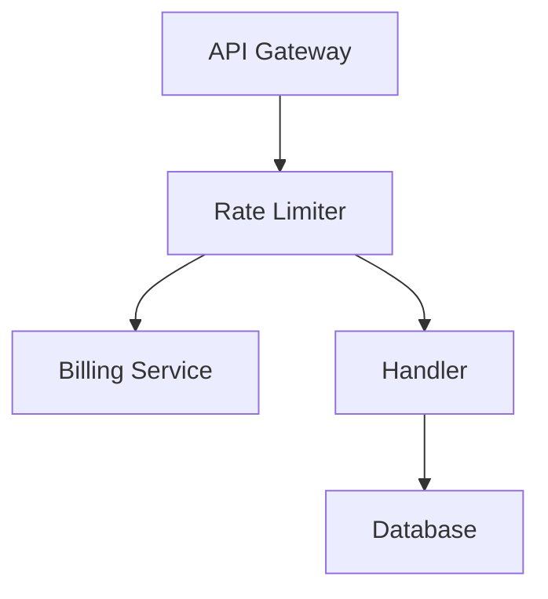

# Architecture Gate — lets-develop-feature

Design checkpoint protocol for non-trivial changes.

## When the Architecture Gate Opens

The gate activates when the change includes ANY of:

- New module, class, or significant abstraction introduced
- Cross-module boundary change (imports between top-level directories)
- Public API surface change (new/modified endpoints, exported interfaces)
- Persistence or schema change (new tables, modified schemas)
- Ownership or dependency-direction change
- New dependency or framework integration
- Layer violation (e.g., controller accessing DB directly)

## Architecture Gate Protocol

### Step 1: Identify the Decision

What structural decision does this change make?

Examples:
- "Where should the new billing logic live?"
- "Should this be a new module or extend an existing one?"
- "Should this be a synchronous call or message-based?"
- "Should we add a new table or extend an existing one?"

### Step 2: Answer the Gate Questions

| Question | Good answer | Red flag |
|----------|------------|----------|
| **Placement** — Does this belong here? | "billing logic → services/billing.py because service layer owns business logic" | "I'll put it wherever is fastest to implement" |
| **Boundary** — Does this respect module boundaries? | "Only accesses user data through the established user_service interface" | "I'll import the User model directly from the other module's internals" |
| **Abstraction** — Is the level right? | "One concrete implementation; we'll abstract when a second provider appears" | "I'm building a generic framework for this one use case" |
| **Contracts** — Backward compatible? | "Adding optional field with default; existing callers unaffected" | "Changing the return type of a widely-used function" |
| **Extensibility** — Will it accommodate known future work? | "The interface supports multiple payment providers; we'll start with Stripe" | "This is hardcoded to Stripe with no seam for alternatives" |
| **Alternatives** — Simpler options? | "Considered X and Y; chose Z because [concrete reason]" | "This was the first thing I thought of" |

### Step 3: Visualize (when complexity warrants it)

For ELEVATED+ rigor or when cross-module boundaries are involved, produce a diagram alongside
the textual decisions. Pick the format that best communicates the architecture:



- Use Mermaid, dot, or ASCII — text formats that diff and version-control
- Show: components, boundaries, dependency direction, data flow
- Update this diagram if Stage 6 implementation diverges from the plan

### Step 4: Document Decisions

```markdown
### Design Decisions

| Decision | Chosen | Alternatives | Why |
|----------|--------|-------------|-----|
| [what] | [approach] | [what else was considered] | [concrete reason] |
```

### Step 5: Checkpoint

**Interactive mode:**
> "Design checkpoint: I'm proposing [key decisions summary]. The main tradeoff is [X]. Proceed?"

**Autonomous mode:**
> "Design checkpoint (autonomous): Proceeding with [approach]. Rationale: [reason]. Alternative was [X], rejected because [Y]. Flagging for review."

## Common Architecture Smells (Red Flags)

| Smell | What it looks like | What to do instead |
|-------|-------------------|-------------------|
| **God module** | Everything goes into one file/class | Split by responsibility |
| **Leaky abstraction** | Caller needs to know internal details | Redesign the interface |
| **Premature abstraction** | Interface with one implementation, no second planned | Use concrete class, extract later |
| **Feature envy** | Method uses more from another module than its own | Move to the right module |
| **Shotgun surgery** | One concept change requires 10+ file edits | Missing abstraction, extract |
| **Circular dependency** | A imports B which imports A | Introduce interface or merge |
| **Layer violation** | Controller has SQL, model makes HTTP calls | Enforce layer discipline |

## When to Escalate

Escalate to user (even in autonomous mode) when:

- Two valid approaches exist with significantly different tradeoffs
- The decision is irreversible and high-impact (schema, public API)
- The codebase has conflicting patterns and it's unclear which to follow
- AGENTS.md is ambiguous about the case you're facing
- The change establishes a new pattern that others will copy

## Standards Precedence

When making design decisions, resolve standards in this order:

1. **AGENTS.md** — explicit repo-level rules (highest priority)
2. **docs/coding-rules.md** or equivalent — team standards
3. **Existing patterns in the codebase** — established conventions
4. **Framework defaults** — how the framework expects things to be structured
5. **Language idioms** — community best practices (lowest priority)

When standards conflict, follow the highest-priority source and note the conflict.
