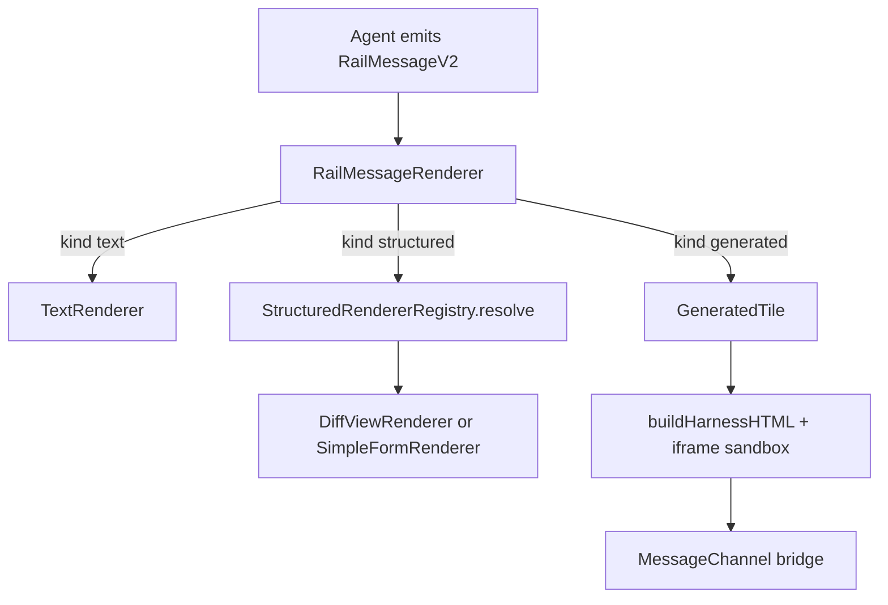

# Assembling a rich response (ux-engine learnings)

## Table of contents

1. [Collate pattern](#collate-pattern)
2. [Host stack](#host-stack)
3. [Per-path assembly](#per-path-assembly)
4. [Agent checklist](#agent-checklist)

## Collate pattern

ux-engine does **not** scatter tile logic across ad-hoc components. It collates in three layers:



**Collate rule:** one message envelope per turn slice; the host router picks the renderer. Your job is to emit the correct `kind` + payload/spec — not to import React components in the agent runtime.

Reference implementations (ux-engine branch `cogsmith-ai/track-2-patterns`):

- [Track2DemoPanel](https://github.com/letsbe10x/ux-engine/blob/cogsmith-ai/track-2-patterns/apps/showcase/src/Track2DemoPanel.tsx) — three fixtures, one registry, one `RailMessageRenderer`.
- [Track2RailPanel](https://github.com/letsbe10x/ground-truth/blob/main/apps/gt-ui/src/agenticUxHost/Track2RailPanel.tsx) — `registerCanonical` + audit adapter + bridge policy.

## Host stack

Assemble these **once per host surface** (not per message):

| Piece | Package | Role |
|-------|---------|------|
| `StructuredRendererRegistry` | ux-runtime | Maps `schemaId@schemaVersion` → component |
| `registerCanonical(registry)` | ux-patterns | Registers `diff-view@1.0.0`, `simple-form@1.0.0` |
| `resolveBridgePolicy(domainProfile)` | ux-runtime | Host-level fetch/navigate allowlist |
| `AuditAdapter` | host app | Persists `GeneratedTileAuditRecord` |
| `RailMessageRenderer` | ux-patterns | Switches on `message.kind` |

Per message, only pass:

```typescript
<RailMessageRenderer
  message={railMessageV2}
  registry={registry}
  auditAdapter={auditAdapter}
  hostPolicy={hostPolicy}
  onActionDispatch={handleDispatch}
  onNavigate={handleNavigate}
  onAskForProse={handleAskForProse}
/>
```

## Per-path assembly

### 1. diff-view (fast-path)

**When:** two text blobs, line-oriented comparison.

**Agent emits:**

- `kind: "structured"`, `schemaId: "diff-view"`, `schemaVersion: "1.0.0"`
- `payload: { left, right, title?, mode? }` — strings only; diff runs in host
- `label` + `summary` for chrome and fallback

**Do not:** generate `React.createElement` for side-by-side text — use this path.

Template: [`assets/templates/structured-diff-view.message.json`](../assets/templates/structured-diff-view.message.json)

### 2. simple-form (fast-path)

**When:** ≤8 typed fields, submit dispatches an action id.

**Agent emits:**

- `kind: "structured"`, `schemaId: "simple-form"`, `schemaVersion: "1.0.0"`
- `payload.fields[]` with `id`, `label`, `type`, `required?`, `options?`
- `submitActionId` must match a host-handled action (see `onActionDispatch` wiring)
- `submitLabel` for button text

**Do not:** build custom form JSX — host renderer owns a11y and tokens.

Template: [`assets/templates/structured-simple-form.message.json`](../assets/templates/structured-simple-form.message.json)

### 3. generated-tile (sandbox)

**When:** custom layout (e.g. metrics grid) and no registry schema fits.

**Agent emits:**

- `kind: "generated"` with nested `tile: GeneratedTileSpec`
- `jsx`: single `React.createElement(...)` tree; embed metrics as string literals
- Use `--ux-*` CSS variables (showcase pattern) — no hardcoded consumer palettes
- `declaredActions` + `allowlist` only if `bridge.*` appears in jsx
- Run [`scripts/validate-tile-jsx.py`](../scripts/validate-tile-jsx.py) before publish

Starter JSX: [`assets/templates/generated-metrics-card.jsx.txt`](../assets/templates/generated-metrics-card.jsx.txt) (from `Track2DemoPanel.makeGeneratedTileMessage`).

### 4. text fallback

**When:** decision tree lands on prose, or validation/publish fails.

Emit `kind: "text"` with `summary` carrying the operator-visible content.

## Agent checklist

1. Load [`assets/tile-kind-decision.yml`](../assets/tile-kind-decision.yml) → outcome `catalog_id`.
2. Look up row in [`assets/component-catalog.yml`](../assets/component-catalog.yml).
3. Fill template under `assets/templates/` or run [`scripts/assemble-rail-message.py`](../scripts/assemble-rail-message.py).
4. For structured paths: run [`scripts/validate-structured-payload.py`](../scripts/validate-structured-payload.py).
5. For generated path: run [`scripts/validate-tile-jsx.py`](../scripts/validate-tile-jsx.py).
6. Publish per [`publish-artifact.md`](publish-artifact.md).

Machine-readable catalog: [`assets/component-catalog.yml`](../assets/component-catalog.yml).
