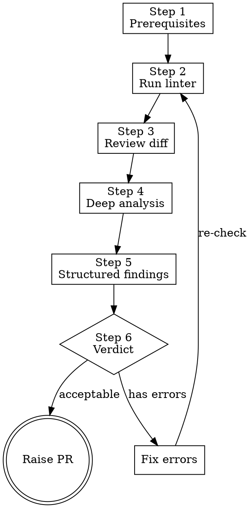

> **Note:** This is the standalone version. For letsbe10x runtime augmentation (context pre-flight, governance, pack enrichment), use the `l10x` profile from [skill-overlay](https://github.com/letsbe10x/skill-overlay).

# lets-review-code

Review a code change for correctness, security, and completeness. Produce structured findings, a go/no-go verdict, and gate PR creation on zero blocking issues.

## Process Flow



## When to use

- After `lets-verify-change` completes with tests passing or skipped
- Final step before raising a PR in the `pr-ship` workflow
- Part of: lets-develop-feature → lets-verify-change → lets-review-code

## When not to use

- `lets-verify-change` has not run yet — run verification before code review.
- You only need to check PR structure/description (use `lets-review-pr`).

## Inputs

- Input: Verification status — tests must have passed or been explicitly skipped
- Input: Repo root path
- Input: The diff or commit to review

---

## Step 1 — Prerequisites check

Before reviewing, confirm:

1. Tests have passed (check via `pytest` or the project's test command)
2. No uncommitted work that should be part of this change (`git status`)

If tests are failing, stop. Go back to `lets-verify-change` and fix failures first.

```bash
git status
git log --oneline -3  # understand the commit being reviewed
```

---

## Step 2 — Run linter (mandatory)

**This step is not optional. Always run the linter before reviewing.**

Detect the project's linter from config files:
- `pyproject.toml` with `[tool.ruff]` → `ruff check src/`
- `package.json` with eslint → `npx eslint src/`
- `.golangci.yml` → `golangci-lint run`
- If no linter configured → note "No linter configured" and proceed

```bash
# Run against changed files only:
ruff check $(git diff --name-only HEAD~1 -- '*.py') 2>&1 || true
# Or project-wide if simpler:
ruff check src/ 2>&1 || true
```

Record:
- Exit code (0 = clean, non-zero = issues)
- Issue count and which are auto-fixable
- Separate pre-existing issues (in files not touched by this commit) from new issues

**Only new issues (in changed files) count toward the verdict.**

---

## Step 3 — Review the diff

Read the full diff of the commit being reviewed:

```bash
git diff HEAD~1..HEAD
# or: git show HEAD
```

Also read the full content of each changed file (context beyond the diff is needed to understand impact).

---

## Step 4 — Deep analysis checklist

After reading the diff, actively check for these patterns. Do not rely on passive reading — probe each category:

### Security
- [ ] Cryptographic choices: is a weak algorithm used where a strong one is needed? (MD5, SHA1 for security purposes, ECB mode, hard-coded keys)
- [ ] Input validation: is user/external input trusted without sanitization?
- [ ] Secrets: any tokens, keys, or credentials in the code or config?
- [ ] Access control: are permission checks present where needed?

### Concurrency
- [ ] Shared mutable state: is data accessed from multiple threads without synchronization?
- [ ] Exception handling in threads: are exceptions in background threads observable? (silently swallowed = invisible failures)
- [ ] Resource lifecycle: is start/stop idempotent? Can double-start or double-stop cause corruption?

### Resource management
- [ ] Unbounded growth: are there lists, dicts, or caches that grow without a cap or eviction policy?
- [ ] Cleanup: are resources (files, connections, threads) properly closed/joined?
- [ ] Error paths: do error handlers leak resources?

### Correctness
- [ ] Off-by-one: boundary conditions in loops, slices, percentile calculations
- [ ] Dead code: functions, variables, or imports that are defined but never used
- [ ] Inconsistent behavior: does the same concept (e.g., "expired") have different definitions in different methods?
- [ ] Things stored but never used: parameters accepted but ignored, fields set but never read

### Test adequacy
- [ ] Does the test suite cover the feature advertised in the commit message?
- [ ] Are error paths tested? (exceptions, edge cases, boundary conditions)
- [ ] Are the tests actually asserting the right thing? (not just "no exception thrown")

---

## Step 5 — Structured findings

Present all findings in a structured table with severity classification:

| # | Severity | Category | Location | Finding |
|---|----------|----------|----------|---------|
| 1 | **error** | Security | `file.py:27` | Description of the issue |
| 2 | **error** | Correctness | `file.py:61` | Description |
| 3 | warn | Concurrency | `file.py:34` | Description |

**Severity definitions:**

| Severity | Meaning | Blocks merge? |
|----------|---------|---------------|
| **error** | Bug, security issue, or correctness defect that will cause problems in production | Yes |
| warn | Non-ideal but functional; technical debt, missing edge case coverage, style issue | No |

**Evidence requirement:** Every finding must cite a specific file and line number. Do not fabricate line references — verify them against the actual file content.

---

## Step 6 — Verdict

After all findings are documented:

| Verdict | Criteria | Action |
|---------|----------|--------|
| **acceptable** | Zero error-severity findings remain | Proceed to PR |
| **acceptable with warnings** | Zero errors, some warns | Proceed to PR, note warnings in description |
| **insufficient** | One or more error-severity findings unresolved | Do not raise PR. Fix errors or escalate to user. |

State the verdict explicitly:
> **Verdict: acceptable** — No blocking issues. Ready to raise PR.

or:
> **Verdict: insufficient** — N error-severity finding(s) must be resolved before merging.

---

## Step 7 — Fix or escalate (if insufficient)

When errors exist:

1. **Auto-fixable lint errors** → fix them (e.g., `ruff check --fix`)
2. **Code bugs you can fix** → offer to fix, then re-run lint and re-verify
3. **Design issues requiring user decision** → surface to user with options

After fixing, re-run linter (Step 2) and re-evaluate verdict.

---

## Step 8 — Raise PR (if acceptable)

When verdict is acceptable:

```bash
git add -p   # review each hunk
git commit -m "feat: ${TASK_SUMMARY}"
git push -u origin "$(git branch --show-current)"
gh pr create \
  --title "$TITLE" \
  --body "## Summary
- [description of change]

## Review notes
- [any warn-severity items noted here]

## Test status
All tests passing."
```

Confirm before posting: "Ready to raise the PR? (y/n)"

---

## Anti-patterns

- **Skipping the linter** — the linter is mandatory. It catches issues that manual review misses (unused imports, unreachable code, style violations). Never skip it.
- **Approving without confirming test status** — verification must be confirmed before approval.
- **Saying "LGTM" without structured findings** — every review must produce findings (even if the finding is "no issues found") with a formal verdict.
- **Marking findings as errors without evidence** — every error-severity finding must cite a specific file:line and explain the concrete failure mode.
- **Commenting on style while missing functional bugs** — functional correctness takes precedence. Check the deep analysis checklist before nitpicking style.
- **Fabricating line references** — if you can't verify the exact line, read the file first. Never guess.

---

## Outputs

- Output: Lint results (exit code, issue count)
- Output: Structured findings table (severity, category, location, description)
- Output: Formal verdict (acceptable / insufficient)
- Output: PR raised via `gh pr create` when acceptable

Done when: verdict is issued, and either PR is raised (acceptable) or errors are surfaced to user (insufficient).
