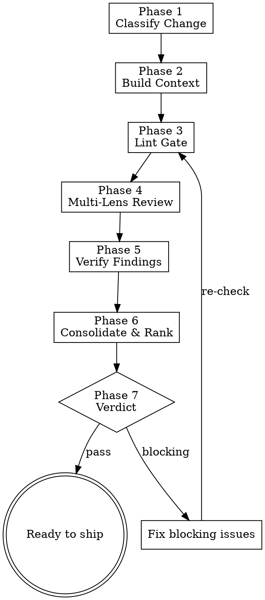

> **Note:** This is the standalone version. For letsbe10x runtime augmentation (context pre-flight, governance, pack enrichment), use the `l10x` profile from [skill-overlay](https://github.com/letsbe10x/skill-overlay).

# lets-review-code

Multi-lens code review with intelligent depth selection. Classifies the change, selects the appropriate review depth, runs specialized lenses in sequence, verifies findings against actual code, and produces a severity-ranked report with confidence scores.

## Process Flow



## When to use

- After `lets-verify-change` completes with tests passing or skipped
- Final quality gate before raising a PR
- Part of: lets-develop-feature → lets-verify-change → **lets-review-code**
- When you want a thorough review that goes beyond surface-level lint

## When not to use

- `lets-verify-change` has not run yet — run verification first.
- You only need to post a review on an existing PR (use `lets-review-pr`).
- The change is a single-line config tweak with no logic impact.

## Inputs

- Input: Verification status — tests must have passed or been explicitly skipped
- Input: Repo root path
- Input: The diff or commit to review (default: HEAD vs HEAD~1)

---

## Phase 1 — Classify the Change

Determine review depth based on change characteristics.

```bash
# Gather metrics
git diff --stat HEAD~1..HEAD
git diff --numstat HEAD~1..HEAD | awk '{added+=$1; removed+=$2} END {print "+" added " -" removed}'
git log --oneline -1 HEAD
```

**Classification matrix:**

| Signal | FULL depth | STANDARD depth | LIGHT depth |
|--------|-----------|----------------|-------------|
| Lines changed | >300 LOC | 50–300 LOC | <50 LOC |
| Files changed | >10 files | 3–10 files | 1–2 files |
| Touches security (auth, crypto, secrets) | Always FULL | — | — |
| New public API surface | Always FULL | — | — |
| Touches persistence/migration | Always FULL | — | — |
| Test-only changes | — | — | Always LIGHT |
| Config/docs only | — | — | Always LIGHT |
| Multi-module/cross-boundary | Always FULL | — | — |

**Depth determines lens activation:**

| Depth | Active lenses |
|-------|---------------|
| FULL | All 6 lenses + AI failure-mode detection |
| STANDARD | Correctness, Security, Completeness + AI failure-mode detection |
| LIGHT | Correctness + quick security scan |

State classification:
> **Classification: STANDARD** — 142 lines across 5 files, touches business logic.

---

## Phase 2 — Build Context

Before reviewing, gather repo context to reduce false positives.

```bash
# Understand the repo
cat AGENTS.md 2>/dev/null || cat README.md 2>/dev/null | head -80
git log --oneline -10

# Understand the change
git log --format="%B" -1 HEAD  # commit message = intent
git diff HEAD~1..HEAD          # full diff
```

**Build a mental model:**
1. **Repo kind** — service / library / CLI / monorepo? (infer from structure)
2. **Module map** — which modules are touched? What are their responsibilities?
3. **Change intent** — what does the commit message claim this does?
4. **Hotspots** — are the changed files in critical paths? (auth, payments, data layer)
5. **Runtime context** — are there resource lifecycles, external clients, or concurrency patterns?

Read the full content of every changed file (not just the diff hunks) — context beyond the diff is essential.

```bash
git diff --name-only HEAD~1..HEAD | while read f; do
  echo "=== $f ==="; cat "$f" 2>/dev/null
done
```

---

## Phase 3 — Lint Gate (mandatory)

**This step is never skipped.**

Detect the linter from config:
- `pyproject.toml` with `[tool.ruff]` → `ruff check`
- `package.json` with eslint → `npx eslint`
- `.golangci.yml` → `golangci-lint run`
- No linter → note "No linter configured" and proceed

```bash
# Run against changed files only
ruff check $(git diff --name-only HEAD~1 -- '*.py') 2>&1 || true
```

Record:
- Exit code (0 = clean)
- New issues (in changed files) vs pre-existing issues
- Auto-fixable count

**Only new issues count toward the verdict.**

---

## Phase 4 — Multi-Lens Review

Run each activated lens sequentially. Each lens has a specific question it answers and patterns it checks.

### Lens 1: Correctness & Logic

**Primary question:** Does the code do what it claims to do?

Check for:
- [ ] Off-by-one errors in loops, slices, boundary conditions
- [ ] Null/None dereferences where value could be absent
- [ ] Type mismatches or unsafe casts
- [ ] Dead code — functions/variables defined but never used
- [ ] Inconsistent behavior — same concept with different definitions across methods
- [ ] Error paths that silently swallow failures (bare except, empty catch)
- [ ] Return values ignored where they indicate failure
- [ ] State mutations in unexpected places (shared mutable state)
- [ ] Race conditions in concurrent code (TOCTOU, unprotected shared state)
- [ ] Resource lifecycle — opened but not closed, double-close, use-after-close

### Lens 2: Security

**Primary question:** Can this code be exploited or does it leak sensitive data?

Check for:
- [ ] Injection vectors — SQL, command, path traversal, template injection
- [ ] Input validation — is external input trusted without sanitization?
- [ ] Authentication/authorization gaps — missing permission checks
- [ ] Secrets in code — tokens, keys, credentials, connection strings
- [ ] Cryptographic weakness — MD5/SHA1 for security, ECB mode, hardcoded keys
- [ ] Data exposure — PII in logs, overly broad API responses, stack traces to clients
- [ ] Dependency risk — new dependencies with known CVEs or suspicious provenance
- [ ] SSRF / open redirect patterns
- [ ] Deserialization of untrusted data

### Lens 3: Architecture & Design

**Primary question:** Is this the right design for the problem?

Check for:
- [ ] Responsibility violations — does this module do things it shouldn't own?
- [ ] Coupling — does this change introduce tight coupling to implementation details?
- [ ] Abstraction fit — is the abstraction level right? (premature abstraction vs. missing abstraction)
- [ ] API design — are public interfaces clear, minimal, and hard to misuse?
- [ ] Extensibility — will this design accommodate known upcoming requirements without rewrite?
- [ ] Duplication drift — is logic being duplicated that should be shared?
- [ ] Layer violations — does a controller contain business logic? Does a model make HTTP calls?

### Lens 4: API & Contracts

**Primary question:** Will this break callers or violate contracts?

Check for:
- [ ] Breaking changes — removed/renamed public methods, changed signatures
- [ ] Backward compatibility — do existing consumers still work?
- [ ] Error contract — are error types/codes consistent with existing patterns?
- [ ] Schema changes — are they additive? Migration path for consumers?
- [ ] Interface parity — if multiple providers exist, do they all handle this?

### Lens 5: Completeness & Test Adequacy

**Primary question:** Is this production-ready?

Check for:
- [ ] Test coverage — does the test suite cover the feature advertised in the commit?
- [ ] Error path testing — are failure modes exercised?
- [ ] Assertion quality — are tests asserting the right thing? (not just "no exception")
- [ ] Edge cases — boundary values, empty inputs, large inputs, unicode, concurrent access
- [ ] Observability — are errors logged? Are metrics emitted for key operations?
- [ ] Configuration — are new config values documented with defaults?
- [ ] Migration — does deployment require ordering? (schema first? flag first?)

### Lens 6: Complexity & Simplification

**Primary question:** Is this more complex than it needs to be?

Check for:
- [ ] Over-engineering — abstractions with only one consumer
- [ ] Speculative generality — code written for hypothetical future requirements
- [ ] Defensive excess — try/catch/retry around code that can't fail in context
- [ ] Custom implementations — reinventing what stdlib or existing deps provide
- [ ] Deep nesting — >3 levels of conditional nesting
- [ ] God objects/functions — single units doing >3 distinct things

### AI Failure-Mode Detection (FULL and STANDARD depth)

Specifically scan for patterns common in AI-generated code:

- [ ] **Polished abstractions with no consumers** — helper classes/functions defined but only called once, or not called at all
- [ ] **Defensive coding without evidence** — broad try/catch, retry logic, fallbacks with no incident or spec justification
- [ ] **Tests weakened to pass** — assertions checking weaker conditions than the spec requires, mocking away the thing being tested
- [ ] **Zombie code** — branches, flags, or parameters that are defined but never exercised in any path
- [ ] **Plausible but wrong** — code that looks correct on the surface but mishandles edge cases (often: encoding, timezone, locale, float precision)
- [ ] **Import bloat** — importing heavy libraries for trivial operations

---

## Phase 5 — Verify Findings

**Every finding must survive verification before it reaches the report.**

For each potential finding from Phase 4:

1. **Re-read the actual code** — not the diff, the full file at the relevant location
2. **Check surrounding context** — 50+ lines around the issue; is there handling elsewhere?
3. **Trace callers/callees** — does a caller handle the case you think is missing?
4. **Check project conventions** — does AGENTS.md or existing code establish a pattern that explains this?
5. **Classify the finding:**

| Classification | Meaning | Include in report? |
|---------------|---------|-------------------|
| **REAL** | Verified issue with concrete impact | Yes |
| **DEFER** | Real concern but out of scope for this change | Yes (as info) |
| **FALSE_POSITIVE** | Apparent issue explained by context | No |

**Only REAL findings affect the verdict.** DEFER findings are noted but don't block.

For each verified finding, record:
- **Confidence** (0.0–1.0): How certain are you this is real?
- **Evidence**: Exact file:line + what you observed
- **Caveat**: What you couldn't verify (e.g., "couldn't trace all callers")
- **Challenge**: How this finding could be wrong

---

## Phase 6 — Consolidate & Rank

Produce the final findings report.

### Severity Normalization

| Severity | Meaning | Blocks merge? |
|----------|---------|---------------|
| **CRITICAL** | Security vulnerability, data loss, or crash in production path | Yes |
| **HIGH** | Bug that will cause incorrect behavior under normal use | Yes |
| **MEDIUM** | Edge case bug, missing validation, or significant tech debt | No (but flag) |
| **LOW** | Style, minor optimization, or defensive improvement | No |

### Report Format

```markdown
## Review Report

**Change:** [commit message / PR title]
**Depth:** [FULL / STANDARD / LIGHT]
**Lenses run:** [list]

### Findings

| # | Severity | Lens | Location | Finding | Confidence |
|---|----------|------|----------|---------|------------|
| 1 | CRITICAL | Security | `auth.py:45` | [description] | 0.95 |
| 2 | HIGH | Correctness | `parser.py:112` | [description] | 0.85 |
| 3 | MEDIUM | Completeness | `service.py:78` | [description] | 0.70 |

### Finding Details

#### Finding 1: [title]
- **What:** [specific issue with file:line]
- **Why it matters:** [concrete impact for THIS system, not generic best-practice]
- **Suggested fix:** [actionable recommendation]
- **Evidence:** [code snippet or trace showing the issue]
- **Confidence:** 0.95
- **Caveat:** [what couldn't be fully verified]

### Deferred Items
[DEFER findings listed here as informational]

### Strengths
[1-3 things the change does well — specific, not filler]
```

### Deduplication

If multiple lenses flag the same location:
- Keep the highest-severity finding
- Merge evidence from both lenses
- Credit both lenses in the report

### Umbrella Findings

When multiple local issues share one root cause (e.g., "no error handling contract" manifesting in 5 places), report the **umbrella finding** with the local symptoms as evidence — don't list 5 separate findings for the same design gap.

---

## Phase 7 — Verdict

| Verdict | Criteria | Action |
|---------|----------|--------|
| **PASS** | Zero CRITICAL or HIGH findings | Ready to ship |
| **PASS_WITH_NOTES** | Zero blocking, some MEDIUM findings | Ship, but note items for follow-up |
| **FAIL** | One or more CRITICAL or HIGH findings | Do not ship. Fix or escalate. |

State the verdict explicitly:

> **Verdict: PASS** — No blocking issues. 2 MEDIUM findings noted for follow-up. Ready to raise PR.

or:

> **Verdict: FAIL** — 1 CRITICAL + 2 HIGH findings must be resolved. See findings 1-3.

---

## Phase 8 — Fix or Escalate (if FAIL)

When blocking findings exist:

1. **Auto-fixable lint errors** → fix them (`ruff check --fix`)
2. **Code bugs you can fix with confidence ≥0.85** → fix, re-run tests, re-lint
3. **Design issues or low-confidence findings** → surface to user with context and options

After fixing, restart from Phase 3 (lint gate) through the full pipeline.

---

## Anti-patterns

- **Skipping the linter** — mandatory. Always.
- **Approving without test confirmation** — verification must be confirmed before approval.
- **Generic "best practice" findings** — every finding must explain impact for THIS system, not cite general rules.
- **Findings without evidence** — every finding must cite file:line with actual code content.
- **False confidence** — if you can't verify a finding, say so in the caveat. Don't present 0.5 confidence findings as certain.
- **Reviewing only the diff** — always read full file context. The diff shows what changed; the file shows what it means.
- **Ignoring AI failure modes** — generated code is often plausible but wrong. Actively probe for the patterns listed above.
- **Style over substance** — functional correctness, security, and architectural fitness take precedence over style. Don't nitpick formatting while missing logic bugs.
- **Reporting symptoms instead of root causes** — if 5 locations share the same design gap, report the gap once with evidence from all 5.

---

## Outputs

- Output: Change classification (type, depth, risk signals)
- Output: Lint results (exit code, new issue count)
- Output: Severity-ranked findings table with confidence scores
- Output: Detailed finding reports with evidence, caveats, and challenges
- Output: Formal verdict (PASS / PASS_WITH_NOTES / FAIL)

Done when: verdict is issued, and either ready to ship (PASS) or blocking issues are surfaced to user (FAIL).
