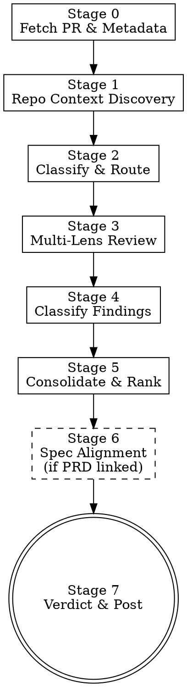

> **Note:** This is the standalone version. For letsbe10x runtime augmentation (context pre-flight, governance, pack enrichment), use the `l10x` profile from [skill-overlay](https://github.com/letsbe10x/skill-overlay).

# lets-review-pr

Planner-driven PR review controlplane. Discovers repo context, classifies the PR, routes to appropriate review lenses based on change characteristics, verifies findings against actual code, consolidates into a severity-ranked report, and optionally posts to GitHub with a structured verdict.

## Process Flow



## When to Use

- Reviewing any PR before merging (yours or others')
- Enforcing a structured review quality bar
- Getting a second opinion on a manually reviewed PR
- Validating implementation against a spec/PRD
- CI-integrated review gate (block merge without structured review)

## When Not to Use

- You are reviewing local uncommitted code before creating a PR (use `lets-review-code`)
- The PR contains secrets or sensitive material you cannot process
- You only need formatting/nit feedback with no correctness analysis

## Inputs

- Input: PR identifier (URL, number, or branch ref)
- Input: Review preferences (optional — strictness level, focus areas, post permission)
- Input: Spec/PRD reference (optional — for spec alignment review)

---

## Stage 0 — Fetch PR & Metadata

```bash
# Accept PR URL, number, or branch
gh pr view $PR_ID --json number,title,body,baseRefName,headRefName,files,additions,deletions,commits,labels,author

# Get the diff
gh pr diff $PR_ID

# Get file list with stats
gh pr diff $PR_ID --stat
```

Extract:
- **Title and body** (claims the PR makes about itself)
- **Base and head branch** (what context this targets)
- **File list with additions/deletions** (scale)
- **Commit history** (was this a single coherent change or accumulated drift?)
- **Labels** (any risk/priority signals)
- **PR body for PRD/spec references** (patterns: `prd-NNN`, `PRD-NNN`, `spec:`, `closes #`)

---

## Stage 1 — Repo Context Discovery

Build a context brief that prevents false positives and ensures architectural awareness.

```bash
# Read repo context
cat AGENTS.md 2>/dev/null
cat CLAUDE.md 2>/dev/null
cat README.md 2>/dev/null | head -100

# Recent history for conventions
git log --oneline -15

# Understand module structure
find . -maxdepth 2 -name "*.py" -o -name "*.ts" -o -name "*.go" | head -50
```

**Produce a context brief covering:**

1. **Repo kind** — service / library / SDK / CLI / monorepo (infer from structure, prefer AGENTS.md)
2. **Module map** — which modules exist, what they own, which are touched by this PR
3. **Architectural invariants** — from AGENTS.md: security rules, boundary constraints, layer restrictions
4. **Hotspots** — are changed files in critical paths? (auth, payments, data, migrations)
5. **Testing conventions** — how does this repo test? (pytest, jest, integration tests, e2e)
6. **Review obligations** — does AGENTS.md specify review requirements for certain areas?

---

## Stage 2 — Classify & Route

Determine pipeline mode and which review lenses to activate.

### PR Classification

| Dimension | Options |
|-----------|---------|
| **Type** | feature / bugfix / refactor / config / docs / test / dependency / migration |
| **Scale** | tiny (<20 LOC) / small (20-100) / medium (100-300) / large (300-1000) / very-large (>1000) |
| **Risk** | low / medium / high / critical |
| **Complexity** | straightforward / moderate / complex / gnarly |

### Pipeline Mode Selection

| Mode | When | Lenses activated |
|------|------|-----------------|
| **FULL** | Large, high-risk, multi-module, security-touching, new public API | All 6 + AI failure modes + spec alignment |
| **STANDARD** | Medium features, bugfixes, moderate refactors | General + Code + Security + Completeness |
| **LIGHT** | Small/config/docs/test-only/deps | General + Code (quick pass) |
| **TARGETED** | When specific concern is obvious | 2-3 relevant lenses only |

### Mandatory Gates (trigger deeper review)

Evaluate each gate — if triggered, activate the specified lens regardless of pipeline mode:

| Gate | Trigger signal | Activates |
|------|---------------|-----------|
| **Security** | Touches auth, crypto, secrets, input validation, deserialization | Security lens (FULL) |
| **Architecture** | New modules, cross-boundary changes, new abstractions, layer violations | Architecture lens |
| **API** | Public interface changes, schema changes, breaking changes | API lens |
| **Complexity** | Deep nesting added, new abstractions with unclear motivation | Complexity lens |
| **AI failure** | Code appears generated (polish without tests, broad catches, unused helpers) | AI failure-mode scan |
| **Spec deviation** | PRD linked + implementation doesn't obviously match requirements | Spec alignment (Stage 6) |

State routing decision:
> **Pipeline: STANDARD** — 180 LOC feature addition, touches business logic and API layer.
> **Active lenses:** General, Code, Security, Completeness, API (gate: public interface change)

---

## Stage 3 — Multi-Lens Review

Run each activated lens. Each lens answers ONE primary question and produces findings.

### Lens: General (Intent & Scope)

**Question:** Does the PR do what it claims, and only what it claims?

- Does the diff match the title/description?
- Is there scope creep (unrelated changes mixed in)?
- Are claims in the PR body substantiated by the code?
- Is the change coherent (one logical change, not accumulated drift)?

### Lens: Code (Correctness & Runtime)

**Question:** Is the implementation correct and reliable?

- Logic errors, off-by-one, null safety
- Error handling — failures masked, swallowed, or propagated correctly?
- Resource lifecycle — opened/closed, leak potential
- Concurrency — shared state, race conditions, deadlock potential
- Runtime hygiene — timeouts, retries, cleanup, graceful degradation
- Type safety and invariant enforcement

### Lens: Security

**Question:** Can this be exploited or does it leak sensitive data?

- Injection vectors (SQL, command, path, template)
- Auth/authz gaps — missing permission checks
- Data exposure — PII in logs, overly broad responses
- Secrets in code
- Dependency risk — new deps with known vulnerabilities
- Delivery surface — Dockerfile, CI config, deploy scripts manipulated
- SSRF, open redirects, deserialization of untrusted data

### Lens: Architecture

**Question:** Is this the right design at the right abstraction level?

- Responsibility placement — does this belong in this module?
- Coupling — are implementation details leaking across boundaries?
- Abstraction fit — premature? Missing? Wrong level?
- Extensibility — will known upcoming work fit without rewrite?
- Simplification opportunities — is existing complexity justified?
- Duplication drift — shared logic being copied instead of extracted

### Lens: API & Contracts

**Question:** Will this break existing callers or violate established contracts?

- Breaking changes to public interfaces
- Error contract consistency
- Schema evolution (additive vs. breaking)
- Version handling
- Consumer impact analysis

### Lens: Completeness

**Question:** Is this production-ready?

- Test coverage for the claimed feature
- Error path testing
- Edge case coverage
- Observability (logging, metrics, tracing)
- Documentation updates needed
- Migration/deployment ordering
- Rollback safety

### AI Failure-Mode Scan (when activated)

- Polished abstractions with one or zero consumers
- Defensive coding without evidence of the failure mode it guards against
- Tests weakened to pass rather than prove correctness
- Zombie code — branches/flags/params never exercised
- Plausible-but-wrong edge case handling
- Import bloat for trivial operations

---

## Stage 4 — Classify Findings

**Every finding must survive verification before reaching the final report.**

For each finding from Stage 3:

1. **Re-read the actual source file** at the cited location (not just the diff)
2. **Check 50+ lines of surrounding context** — is there handling elsewhere?
3. **Trace callers and callees** — does a caller already handle the case you flagged?
4. **Check project conventions** — does AGENTS.md or existing patterns explain this?
5. **Classify:**

| Classification | Meaning | Report? | Blocks? |
|---------------|---------|---------|---------|
| **REAL** | Verified issue, concrete impact | Yes | If CRITICAL/HIGH |
| **DEFER** | Real but out of scope for this PR | Yes (info) | No |
| **FALSE_POSITIVE** | Explained by context or conventions | No | No |

For REAL findings, also produce:
- **Fix suggestion**: What specifically should change
- **Challenge**: How this finding could be wrong (intellectual honesty)

---

## Stage 5 — Consolidate & Rank

### Severity Normalization

| Severity | Meaning | Blocks approval? |
|----------|---------|-----------------|
| **CRITICAL** | Security vuln, data loss, crash in production path | Yes |
| **HIGH** | Bug causing incorrect behavior under normal use | Yes |
| **MEDIUM** | Edge case, missing validation, significant tech debt | No |
| **LOW** | Style, minor optimization, nitpick | No |

### Deduplication Rules

- Same file:line flagged by multiple lenses → keep highest severity, merge evidence
- Multiple local findings sharing one root cause → report as umbrella finding
- Conflicting assessments from different lenses → note both perspectives with evidence

### Consolidation Output

```markdown
## PR Review: [PR title]

**PR:** #[number] | **Author:** [author] | **Base:** [base branch]
**Classification:** [type] / [scale] / [risk]
**Pipeline:** [mode] | **Lenses:** [list]

---

### Summary

[One paragraph: what this PR does, overall assessment, key risk signals]

---

### Findings

| # | Severity | Lens | Location | Finding | Confidence |
|---|----------|------|----------|---------|------------|
| 1 | CRITICAL | Security | `path:line` | [brief] | 0.95 |
| 2 | HIGH | Code | `path:line` | [brief] | 0.85 |

---

### Finding Details

#### [F1] [Title] — CRITICAL
- **What:** [specific issue with `file:line` evidence]
- **Why it matters:** [concrete impact for THIS system]
- **Fix:** [actionable recommendation]
- **Evidence:** [code snippet showing the issue]
- **Confidence:** 0.95
- **Caveat:** [what couldn't be verified]
- **Challenge:** [how this could be wrong]

---

### Deferred Items
[Issues that are real but out of scope for this PR]

### Strengths
[2-3 specific things the PR does well — not filler]

---

### Recommendation

**[APPROVE / REQUEST_CHANGES / COMMENT]**

[One-sentence rationale citing the key blocking finding or overall quality]
```

---

## Stage 6 — Spec Alignment (if PRD/spec linked)

**Only runs when a PRD or spec is referenced in the PR body or explicitly requested.**

### Locate the Spec

```bash
# Search ground-truth or docs for the referenced spec
find . -path "*/prds/*" -o -path "*/features/*" -o -path "*/specs/*" | grep -i "$SPEC_ID"
```

### Spec Alignment Analysis

For each P0/P1 requirement in the spec:

| Requirement | Status | Evidence |
|------------|--------|----------|
| [Req from spec] | Implemented / Partial / Missing | `file:line` or "not found" |

### Contract Compliance

If the spec defines interfaces, schemas, or protocols:
- Does the implementation match the specified contract exactly?
- Are all specified error codes/types present?
- Are all specified fields present with correct types?

### Architectural Invariant Check

Cross-reference AGENTS.md security/architectural invariants:
- Engine isolation (no outward deps from core engine)
- Principal separation (credentials injected, not env-read)
- Subprocess safety (list args, never shell strings)
- Fail-closed security evaluation
- Tightening-only policy hierarchy

Report violations as CRITICAL findings.

### Spec Verdict

> **Spec compliance: PARTIAL** — 8/10 P0 requirements implemented. 2 missing: [list]. See findings F4, F5.

---

## Stage 7 — Verdict & Post

### Verdict Logic

| Condition | Verdict |
|-----------|---------|
| Zero CRITICAL + zero HIGH findings | **APPROVE** |
| Zero CRITICAL/HIGH + some MEDIUM | **COMMENT** (approve with suggestions) |
| Any CRITICAL or HIGH finding unresolved | **REQUEST_CHANGES** |
| Spec alignment: P0 requirements missing | **REQUEST_CHANGES** |

### GitHub Posting

If posting is requested:

```bash
# Approval
gh pr review $PR_ID --approve --body "$REVIEW_BODY"

# Request changes
gh pr review $PR_ID --request-changes --body "$REVIEW_BODY"

# Comment only
gh pr review $PR_ID --comment --body "$REVIEW_BODY"
```

**Checkpoint:** Confirm before posting:
> "Ready to post this review to GitHub as REQUEST_CHANGES? (y/n)"

If user does not confirm, produce the review body only without posting.

### Posted Review Format

When posting to GitHub, format for readability:

```markdown
## Review: [verdict emoji] [APPROVE/REQUEST_CHANGES/COMMENT]

**Pipeline:** [mode] | **Lenses:** [active lenses]

### Summary
[One paragraph assessment]

### Findings ([count])

<details>
<summary>🔴 CRITICAL ([count])</summary>

**[F1] [title]** — `file:line`
[description + fix suggestion]

</details>

<details>
<summary>🟠 HIGH ([count])</summary>
...
</details>

<details>
<summary>🟡 MEDIUM ([count])</summary>
...
</details>

### Strengths
- [specific positive observation]

---
*Reviewed with lets-review-pr v3.0.0 | [FULL/STANDARD/LIGHT/TARGETED] pipeline*
```

---

## Error Handling

- **Diff fetch fails** → ask for PR URL or number, retry
- **PR identifier ambiguous** → list matching PRs, ask user to pick
- **Auth missing for posting** → produce review body + exact `gh` command the user can run
- **Spec referenced but not found** → skip Stage 6, note "spec not located" in report
- **Very large PR (>1000 LOC)** → warn user, suggest splitting, review if they confirm

---

## Anti-patterns

- **Approving with unresolved CRITICAL/HIGH findings** — every blocking finding must be resolved or explicitly deferred by the user before approval.
- **Reviewing only the diff without context** — always read AGENTS.md, full source files, and understand module boundaries.
- **Generic findings** — "this could be a security issue" is not a finding. Cite the specific code, the specific attack, and the specific impact.
- **Fabricating evidence** — never invent line numbers or code snippets. If you can't verify, note the caveat.
- **Style-heavy reviews** — functional correctness and security take absolute precedence over style.
- **Posting without confirmation** — always checkpoint before writing to GitHub.
- **Treating all PRs the same** — a config change doesn't need the same depth as a security-touching feature. Use pipeline modes.
- **Missing the forest for the trees** — if 5 findings share one root cause, report the root cause.
- **Performative approval** — saying LGTM without structured findings is never acceptable.

---

## Outputs

- Output: PR classification (type, scale, risk, complexity)
- Output: Context brief (repo kind, module map, invariants)
- Output: Severity-ranked findings with confidence and evidence
- Output: Spec compliance assessment (if PRD linked)
- Output: Verdict (APPROVE / REQUEST_CHANGES / COMMENT) with rationale
- Output: GitHub review comment posted (if confirmed)

Done when: Review includes an explicit verdict with evidence-backed rationale, and either posting is confirmed or review body is delivered to user.
