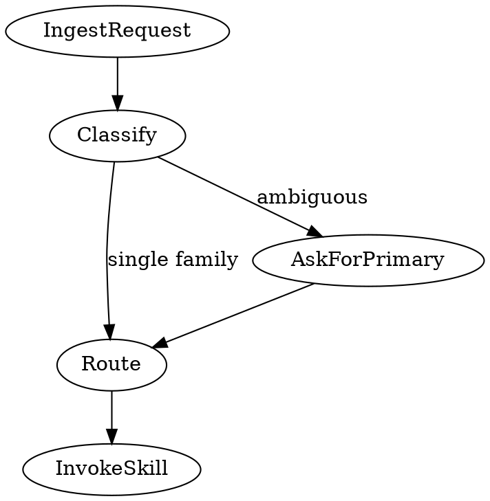

> **Note:** This is the standalone version. For letsbe10x runtime augmentation (context pre-flight, governance, pack enrichment), use the `l10x` profile from [skill-overlay](https://github.com/letsbe10x/skill-overlay).

# lets-start-here

Canonical routing front door for all letsbe10x SDLC workflows.

## Red Flags — Do Not Skip This Skill

These thoughts mean STOP — you are rationalizing:

| Thought | Reality |
|---|---|
| "I already know which skill to use" | Governance context must load first. Invoke lets-start-here anyway. |
| "This is a simple request, no skill needed" | Simple requests still need routing. A one-liner response still needs context. |
| "The user said to do X, that maps to skill Y" | Classification confirms scope. Skipping it risks governance misroutes. |
| "I'll just run the goal directly" | Goals without classification skip governance verdict. Don't. |
| "Another skill is more specific" | lets-start-here routes TO that skill. It is not an alternative to it. |

## When to use

- You are starting a new task and are unsure which skill to invoke
- You want a governance check before beginning any SDLC activity
- You need to classify an ambiguous request before acting on it
- You are setting up an automated pipeline and want classification-driven routing

## When not to use

- You already know the exact goal skill to invoke and do not need routing.
- You are running a fully automated pipeline where routing facts are precomputed and locked.

## Inputs and outputs

- Input: A short natural-language request describing the task.
- Input: Repo context readiness score (if available).
- Output: A routing summary (selected skill, governance verdict, confidence, and why).
- Done when: The user has confirmed the routing decision and the selected skill is invoked.

## Route Family → Skill Mapping

| Request family | Goal | Skill invoked |
|---|---|---|
| Any open question / explore / decide / design | `explore` | `lets-brainstorm` |
| Build / implement / code change (with or without spec) | `change_code` | `lets-develop-feature` |
| Investigate failure / bug | `investigate_change` | `lets-triage-issue` |
| On-call / incident | `inspect_service` + `investigate_change` | `lets-triage-incident` |
| Plan work / spec a change (spec already written) | `create_plan` | `lets-create-plan` |
| Review a PR / diff | `review_change` | `lets-review-pr` |
| Verify tests pass | `verify_change` | `lets-verify-change` |
| Onboard / understand a repo | `onboard_repo` | `lets-onboard-repo` |
| Audit repo governance | `audit_governance` | `lets-audit-repo` |
| Bootstrap a new repo | `bootstrap_repo` | `lets-bootstrap-repo` |
| Deploy a service | `deploy_service` | `lets-deploy-check` |
| Spec a change to PR | `change_code` (spec-driven) | `lets-spec-to-pr` |

**Key disambiguations:**

| Intent signal | Route to | Why |
|---|---|---|
| "how should we", "what's the best way", "help me think through", open question | `lets-brainstorm` | No implementation intent — exploring |
| "build this", "implement", "add feature", "make this change" (regardless of spec) | `lets-develop-feature` | Implementation intent — develop-feature handles spec discovery via Phase 0 |
| "plan the implementation" (spec already exists) | `lets-create-plan` | Plan only, not execution |

**Brainstorm is for any open question** — not just pre-implementation. It handles research, strategy, architecture decisions, and any creative exploration where the right answer isn't yet agreed.

**Observability disambiguation:** if the request text contains any of `["alert", "pager", "firing", "incident", "on-call", "sev1", "sev2"]`, route to `lets-triage-incident`. Otherwise route to `lets-triage-issue`.

---

## Anti-patterns

- **Routing to multiple skills simultaneously** — pick one. If the request matches two families, ask which is primary.
- **Bypassing lets-start-here when a trigger matches** — lets-start-here exists so governance context loads first.
- **Routing to lets-develop-feature for investigative requests** — development and investigation are separate goal paths.
- **Routing to lets-brainstorm when implementation is clearly intended** — lets-develop-feature handles its own spec discovery via Phase 0; don't force a separate brainstorm when the user wants to build.
- **Treating the routing table as exhaustive** — if no family matches, classify as ambiguous and ask.

## Process



---

## Phase 1 — Classify intent

Read the user's request and classify it against the Route Family → Skill Mapping table above.

If classification is ambiguous (request could match two families), ask the user which is primary before proceeding.

If confidence is low (the request doesn't cleanly map to any family), present your best guess routing with reasoning and ask the user to confirm before handing off.

---

## Phase 2 — Present routing summary and confirm

Present routing facts to the user in three categories:

**OBSERVED** (from the request and available repo context):
- Route family
- Risk level (inferred from request language)
- Confidence

**INFERRED** (derived from classification):
- Selected goal sequence
- Target skill
- Rationale (one sentence)

**UNKNOWN** (absent from available context):
- List any fields where values could not be determined

Then confirm with the user before proceeding:
- If confidence is high and route is unambiguous: display the summary and proceed unless the user objects.
- If confidence is below 0.5: present routing as INFERRED and ask the user to confirm before handing off.

---

## Phase 3 — Hand off to selected skill

Based on the route family and the mapping table above, invoke the selected skill.

**brainstorm (idea, no spec):**
Invoke `lets-brainstorm` skill. It explores intent, produces an approved spec, and hands off to `lets-create-plan`.

**delivery:**
Invoke `lets-develop-feature` skill. The lets-develop-feature → lets-verify-change → lets-review-code pipeline handles sequencing.

**verify_only:**
Invoke `lets-verify-change` skill.

**review_only:**
Invoke `lets-review-pr` skill.

**observability (alert present):**
Invoke `lets-triage-incident` skill.

**observability (no alert):**
Invoke `lets-triage-issue` skill.

**discovery:**
Invoke `lets-onboard-repo` skill.

**read_only:**
Invoke `lets-audit-repo` skill.

---

## Hard rules

- Never invoke a skill that does not appear in the route family mapping table without user confirmation.
- If confidence is below 0.5, present routing as INFERRED and ask the user to confirm before handing off.

## Example

```text
User: help me with this repo, I need to deploy a change
Response: classifies request, shows OBSERVED/INFERRED/UNKNOWN, then routes to lets-deploy-check.
```
