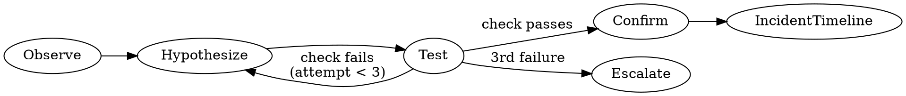

## Investigation Law

**NO ROOT CAUSE CLAIM WITHOUT EVIDENCE TRAIL FIRST.**

If Phase 1 (Observe) is not complete, you cannot move to Phase 2.
If Phase 2 (Hypothesize) is not complete, you cannot run Phase 3.
If 3 or more hypotheses have failed: stop. Do not form a fourth hypothesis.
This is not a failed investigation — this is a systems architecture problem.
Escalate before continuing.

## Overview

`lets-triage-incident` is the on-call engineer's first responder skill. It walks through a
structured incident triage process: capturing the symptom, inspecting the current service state,
tracing what changed around the incident start time, correlating adapter signals, and producing a
concise incident timeline that connects detection to root cause hypothesis and mitigation.

The output is designed to be directly usable as an incident report — handed to a post-mortem, pasted
into a ticket, or shared with the team — without requiring manual reformatting.

## Phase 0 — Load workflow context and classification

Read context artifacts from the active run manifest before executing this goal.

```bash
lets run list --format json | jq '.[0].run_dir // empty'
```

If a `run_dir` is found:
1. Read `workflow_context.json` from the resolved run directory — extract `must_preserve` (non_negotiables + critical_paths) and `defaults`. If absent, log `[warn] workflow_context.json not found — continuing with empty context` and proceed.
2. Read `classification.json` from the same run directory — extract `governance_verdict`. If absent, log `[warn] classification.json not found` and proceed.
3. If `governance_verdict == "BLOCK"`: halt triage and escalate the block to the on-call coordinator.
4. Embed `must_preserve.critical_paths` in context for all subsequent phases.

If no active run directory exists, skip Phase 0 silently.

---

## When to Use

- A production service is exhibiting unexpected behavior and you are the on-call responder.
- An alert has fired and you need to quickly determine scope, cause, and next action.
- You are conducting a preliminary triage before escalating to a specialist.
- You want a structured incident record for post-mortem purposes.

## Inputs

- Input: Incident description or alert URL/text
- Input: Incident start time or window
- Input: Repo root path (for `investigate_change`)

## Example

```bash
# Capture current service state and trace recent changes
lets run exec --goal inspect_service --repo-root /workspace/myservice
lets run exec --goal investigate_change --repo-root /workspace/myservice --since 2h
```

Confirm scope before proceeding: "Is this the correct service and incident window? (y/n)"

## Steps

### Phase 1 — Observe (collect signals, no interpretation yet)

1. Run `lets run exec --goal inspect_service` → capture service state snapshot: alert details, health checks, active error conditions.
2. Run `lets run exec --goal investigate_change` → trace what changed: commits, deploys, config changes in the incident window.
3. Record verbatim: what changed, when, what the alert or error looks like.

Do not interpret yet. Phase 1 is complete when you have raw signal from both goals.

### Phase 2 — Hypothesize

4. Form ONE hypothesis: "Symptom X is caused by Y because Z."
5. State confidence: high / medium / low.
6. Do not form multiple hypotheses at once.

### Phase 3 — Test

7. Run ONE targeted check per hypothesis.
8. If the check fails to confirm the hypothesis: discard it, return to Phase 2.
9. Do not stack multiple changes to test multiple hypotheses simultaneously.
10. After 3 failed hypotheses: stop. See Escalation Criteria below.

### Phase 4 — Confirm

11. Evidence must show the root cause resolves the symptom.
12. Write the incident timeline only after Phase 4 passes.
13. Produce the structured incident timeline using [references/incident-timeline-template.md](references/incident-timeline-template.md): T-0 detection, contributing changes, root cause hypothesis with confidence, recommended mitigation.

Do not write the incident timeline with pending hypotheses.

## Escalation Criteria

Escalate immediately (do not attempt further investigation) when:
- 3 or more hypotheses have failed
- Signals from different adapters directly contradict each other with no reconcilable explanation
- The incident window shows no correlated changes in any adapter
- Mitigation attempts have been running for > 30 minutes without improvement

When escalating: state the 3 failed hypotheses, the evidence gathered, and what is unknown.

## Related Skills

- `lets-watch-service` — use before triage to get a correlated verdict across all four watchtower surfaces; it auto-escalates here on CRITICAL.
- `lets-manage-alerts` — narrow into the alerts surface only.
- `lets-inspect-metrics` — narrow into Prometheus/Grafana metrics only.
- `lets-search-logs` — narrow into Splunk logs only.
- `lets-diagnose-k8s` — narrow into Kubernetes state only.

## Anti-patterns

- **"Quick fix first, investigate later"** — blocked. Phase 1 must complete first.
- **Proposing a mitigation before Phase 1 output exists** — blocked.
- **Stacking multiple changes to see what sticks** — blocked. One variable per test.
- **Writing a root cause claim with no evidence trail** — blocked.
- **Continuing past 3 failed hypotheses without escalating** — blocked.
- **Exposing sensitive incident data in shared channels or findings** — blocked. Do not expose customer data, credentials, or PII in any incident output.
- **Performing destructive actions (rollbacks, restarts, data wipes) without explicit approval** — blocked. All destructive actions require on-call lead sign-off.

## Process



## Outputs

A structured incident timeline containing:

- Output: **T-0** — detection event: timestamp, symptom, and source (alert / user report / monitoring).
- Output: **Contributing changes** — timestamped list of commits, deploys, or config changes in the incident window that are plausible contributors.
- Output: **Root cause hypothesis** — the most probable cause with confidence level (high / medium / low) and supporting evidence.
- Output: **Recommended mitigation** — the immediate action to stop the bleeding (e.g. rollback, feature flag off, scale up), distinct from the long-term fix.

Done when: the incident timeline is written to the run store and a recommended mitigation is stated explicitly.
