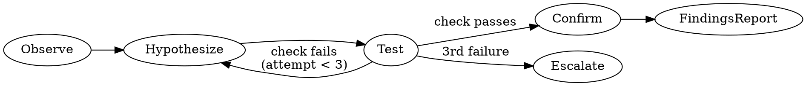

## Investigation Law

**NO ROOT CAUSE CLAIM WITHOUT EVIDENCE TRAIL FIRST.**

If Phase 1 (Observe) is not complete, you cannot move to Phase 2.
If Phase 2 (Hypothesize) is not complete, you cannot run Phase 3.
If 3 or more hypotheses have failed: stop. Do not form a fourth hypothesis.
This is not a failed investigation — this is a systems architecture problem.
Escalate before continuing.

## Overview

`lets-triage-issue` is a structured debugging workflow that combines two engine goals to systematically
diagnose failing runs or unexpected service behavior. It first captures a snapshot of the current
service state, then traces what changed to produce that state — giving you correlated evidence rather
than isolated signals.

Use this skill when a run has failed, a service is misbehaving, or you need to understand *why* a
particular outcome occurred. The skill terminates with a written findings report that can be acted
on directly or handed off to another engineer.

## Phase 0 — Load workflow context (optional)

If letsbe10x is installed and an active run directory exists, read
context artifacts before executing:

```bash
# Only if the lets CLI is installed:
lets run list --format json 2>/dev/null | jq '.[0].run_dir // empty'
```

When a run directory is found, read `workflow_context.json` and
`classification.json` from it. Extract `must_preserve`, `defaults`,
`engineering.doctrine_sources`, and `governance_verdict`. If
`governance_verdict == "BLOCK"`: stop. Embed `must_preserve.critical_paths`
in context for all subsequent phases.

If letsbe10x is not installed, or no active run exists, skip Phase 0
silently and proceed with the standalone investigation below.

---

## When to Use

- A CI run or workflow has failed and the error message alone is insufficient.
- A service is returning unexpected results and you need to trace the cause.
- You want to correlate a recent code change with a runtime symptom.
- Post-incident review requires structured evidence, not just logs.
- Another skill (e.g. `lets-triage-incident`) escalates to investigation mode.

## Inputs

- Input: A concrete failure symptom or run ID to investigate
- Input: Repo root path
- Input: Time window for the investigation (optional — defaults to last 24 hours)

## Example

```bash
# Platform-accelerated path (if letsbe10x is installed):
lets run exec --goal inspect_service    --repo-root /workspace/myrepo
lets run exec --goal investigate_change --repo-root /workspace/myrepo

# Standalone path (no platform required):
gh run view <failing-run-id> --log     # CI logs
git log --oneline -20                   # recent commits
git diff HEAD~10..HEAD -- :*.{yml,json,toml}   # config drift
gh pr list --state merged --limit 5     # recent merges
```

Confirm before committing to a hypothesis: "Is this the correct failure scope? (y/n)"

## Steps

### Phase 1 — Observe (collect signals, no interpretation yet)

1. **Inspect service state.** Two paths:
   - *Platform-accelerated:* `lets run exec --goal inspect_service` →
     captures health checks, recent output, active error conditions.
   - *Standalone:* gather the same signals directly:
     - CI run output: `gh run view <run-id> --log` or `gh run list --json conclusion,databaseId`
     - Service logs: `docker logs <container>` / `kubectl logs <pod>` / `journalctl -u <unit>`
     - Health endpoint: `curl <service-url>/health` if available
     - Recent test output: `pytest --lf -v` / `npm test -- --reporter=verbose`
   Record the symptom verbatim — exact error message, timestamp, and source.

2. **Investigate change.** Two paths:
   - *Platform-accelerated:* `lets run exec --goal investigate_change` →
     traces commits, config diffs, dependency updates relative to the last
     known-good state.
   - *Standalone:* same trace via standard git/gh tools:
     - Recent commits: `git log --oneline --since="48 hours ago"`
     - Config changes: `git diff HEAD~N -- :*.{yml,yaml,json,toml,env,conf}`
     - Dependency changes: `git diff HEAD~N -- '*lock*' 'package.json' 'pyproject.toml' 'Cargo.toml'`
     - Merged PRs: `gh pr list --state merged --limit 10 --json title,mergedAt,author`
     - Open issues: `gh issue list --state open --limit 5 --label bug`

3. Record verbatim: what changed, when it changed, what the error looks like.

Do not interpret yet. Phase 1 is complete when you have raw signal from both
the service-state and change-history sides.

### Phase 2 — Hypothesize

4. Form ONE hypothesis: "Symptom X is caused by Y because Z."
5. State confidence: high / medium / low.
6. Do not form multiple hypotheses at once. Do not proceed to Phase 3 until one hypothesis is committed.

### Phase 3 — Test

7. Run ONE targeted check per hypothesis. Examples:
   - Recent commit suspected: `git revert <sha>` in a worktree, re-run the failing test.
   - Config drift suspected: diff the suspect file pre/post change; restore the prior value in a branch and re-test.
   - Dependency upgrade suspected: pin to the previous version (`pyproject.toml` / `package.json`), reinstall, re-test.
   - Platform-accelerated equivalent: `lets run exec --goal investigate_change --filter COMPONENT`.
8. If the check fails to confirm the hypothesis: discard the hypothesis, return to Phase 2.
9. Do not stack multiple changes to test multiple hypotheses simultaneously.
10. After 3 failed hypotheses: stop. See Escalation Criteria.

### Phase 4 — Confirm

11. Evidence must show the root cause resolves the symptom.
12. Write the findings report only after Phase 4 passes.
13. Produce the structured findings report using [references/findings-template.md](references/findings-template.md): symptom, root cause, evidence trail, recommended action.

Do not write findings with pending hypotheses.

## Anti-patterns

- **"Quick fix first, investigate later"** — blocked. Phase 1 must complete first.
- **Proposing a mitigation before Phase 1 output exists** — blocked.
- **Stacking multiple changes to see what sticks** — blocked. One variable per test.
- **Writing a root cause claim with no evidence trail in the findings report** — blocked.
- **Continuing past 3 failed hypotheses without escalating** — blocked.
- **Logging sensitive information in findings or debug output** — blocked. Mask or omit credentials, tokens, PII, and secrets from all output.

## Process



## Outputs

A structured investigation report written to the run store and printed to stdout. The report
contains four sections:

- Output: **Symptom** — the observed failure or unexpected behavior, with timestamps.
- Output: **Root cause hypothesis** — the most probable cause, ranked by evidence weight.
- Output: **Evidence** — specific log lines, diff hunks, or metric values that support the hypothesis.
- Output: **Recommended action** — a concrete next step (e.g. revert commit X, fix config Y, escalate).

Done when: the findings report is written to the run store and the recommended action is stated explicitly.
